<div class="MCWHeader1">
SAP plus extend and innovate
</div>

<div class="MCWHeader2">
Hands-on lab step-by-step
</div>

<div class="MCWHeader3">
May 2022
</div>


Information in this document, including URL and other Internet Web site references, is subject to change without notice. Unless otherwise noted, the example companies, organizations, products, domain names, e-mail addresses, logos, people, places, and events depicted herein are fictitious, and no association with any real company, organization, product, domain name, e-mail address, logo, person, place or event is intended or should be inferred. Complying with all applicable copyright laws is the responsibility of the user. Without limiting the rights under copyright, no part of this document may be reproduced, stored in or introduced into a retrieval system, or transmitted in any form or by any means (electronic, mechanical, photocopying, recording, or otherwise), or for any purpose, without the express written permission of Microsoft Corporation.

Microsoft may have patents, patent applications, trademarks, copyrights, or other intellectual property rights covering subject matter in this document. Except as expressly provided in any written license agreement from Microsoft, the furnishing of this document does not give you any license to these patents, trademarks, copyrights, or other intellectual property.

The names of manufacturers, products, or URLs are provided for informational purposes only and Microsoft makes no representations and warranties, either expressed, implied, or statutory, regarding these manufacturers or the use of the products with any Microsoft technologies. The inclusion of a manufacturer or product does not imply endorsement of Microsoft of the manufacturer or product. Links may be provided to third party sites. Such sites are not under the control of Microsoft and Microsoft is not responsible for the contents of any linked site or any link contained in a linked site, or any changes or updates to such sites. Microsoft is not responsible for webcasting or any other form of transmission received from any linked site. Microsoft is providing these links to you only as a convenience, and the inclusion of any link does not imply endorsement of Microsoft of the site or the products contained therein.

© 2022 Microsoft Corporation. All rights reserved.

Microsoft and the trademarks listed at <https://www.microsoft.com/en-us/legal/intellectualproperty/Trademarks/Usage/General.aspx> are trademarks of the Microsoft group of companies. All other trademarks are property of their respective owners.

**Contents** 

<!-- TOC -->
- [SAP plus extend and innovate hands-on lab step-by-step](#sap-plus-extend-and-innovate-hands-on-lab-step-by-step)
  - [Abstract and learning objectives](#abstract-and-learning-objectives)
  - [Overview](#overview)
  - [Solution architecture](#solution-architecture)
  - [Requirements](#requirements)
  - [Before the hands-on lab](#before-the-hands-on-lab)
  - [Exercise 1: Prepare sales data in SAP](#exercise-1-prepare-sales-data-in-sap)
    - [Task 1: Populate SAP data](#task-1-populate-sap-data)
    - [Task 2: Expose SAP sales data as an OData service](#task-2-expose-sap-sales-data-as-an-odata-service)
  - [Exercise 2: Prepare payment data in Cosmos DB](#exercise-2-prepare-payment-data-in-cosmos-db)
    - [Task 1: Create linked services in Azure Synapse Analytics](#task-1-create-linked-services-in-azure-synapse-analytics)
    - [Task 2: Create source and sink integration datasets](#task-2-create-source-and-sink-integration-datasets)
    - [Task 3: Create pipeline to ingest payment data into Cosmos DB](#task-3-create-pipeline-to-ingest-payment-data-into-cosmos-db)
  - [Exercise 3: Install the self-hosted integration runtime on the SAP virtual machine](#exercise-3-install-the-self-hosted-integration-runtime-on-the-sap-virtual-machine)
    - [Task 1: Download and install the self-hosted integration runtime](#task-1-download-and-install-the-self-hosted-integration-runtime)
  - [After the hands-on lab](#after-the-hands-on-lab)
    - [Task 1: Task name](#task-1-task-name)
    - [Task 2: Task name](#task-2-task-name)

<!-- /TOC -->

# SAP plus extend and innovate hands-on lab step-by-step 

## Abstract and learning objectives 

In this hands-on lab you will:

1. Extract (historical) Sales Orders from SAP S/4HANA using Azure Synapse Analytics pipelines

2. Extract historical payments from a non-SAP system, in this example Cosmos DB using Azure Synapse Analytics pipelines

3. Visualize the extracted Sales Orders and invoice data with Power BI

4. Predict incoming cash flow for Sales Orders using Azure Machine Learning

5. Trigger actions in SAP based on insights gained from the prediction

## Overview

When customers buy goods, the corresponding payments are not completed immediately. Some customers will pay directly while other customers will pay at the end of their payment terms. This makes it difficult for companies to predict the incoming cashflow. In this simplified exercise, Azure tooling is used to predict the incoming cashflow. To predict cash flow, historical Sales Orders and payments data is required. Contoso Retail also needs a way to flag risky customers in the SAP system whose payments tend to arrive late.

## Solution architecture


 Sales Order information is stored in an S/4HANA system and payments data is stored in Cosmos DB. Synapse Pipelines are used to ingest historical data from both sources. Power BI is used to visualize historical data and to create reports. Azure Machine Learning is used to create a model to predict incoming cash flow. Finally, a data alert is established to identify risky payers whose payments are typically late. This alert triggers a Power Automate process that will in-turn flag the risky payers in SAP.

## Requirements

1.  Azure Subscription with Owner role

2.  SAP CAL account

3.  Power Platform account or membership in the [Microsoft 365 Developer Program](https://developer.microsoft.com/microsoft-365/dev-program)

## Before the hands-on lab

Refer to the Before the hands-on lab setup guide manual before continuing to the lab exercises.

## Exercise 1: Prepare sales data in SAP

Duration: X minutes

This exercise demonstrates creating a sales view in SAP and exposing it as an OData service for consumption by external services.

### Task 1: Populate SAP data

1. On the SAP Cloud Appliance Library Instances page, select the **Connect** button on the **MCW SAP** row.

    

2. On the **Connect to the instance** dialog, select the **Connect** link on the RDP row. This will download an RDP file.

    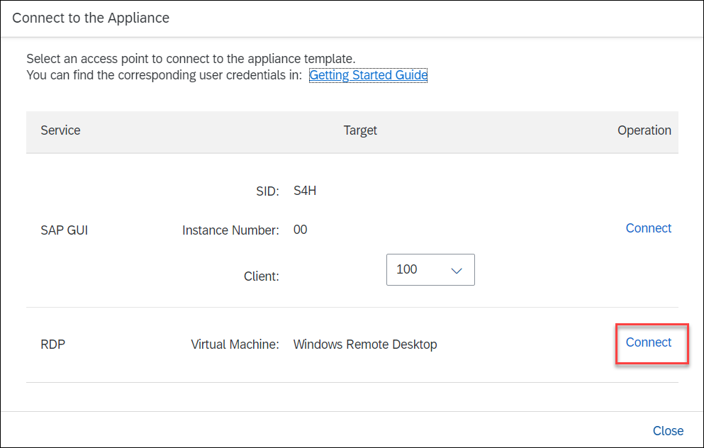

3. Open the downloaded RDP file and log into the instance using the username `Administrator` and the password used when deploying the instance.

4. From the desktop double-click the **HANA Studio** icon. This will open the Eclipse development environment.

    

5. In the **Select a directory as workspace** dialog, keep the default value and select **Launch**. Launching will take a few moments, please be patient.

    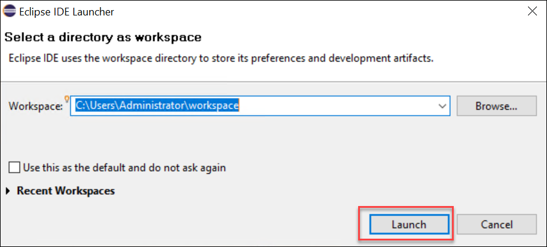

6. Change the perspective to development by expanding the **Window** menu, **Perspective**, **Open Perspective**, then selecting the **SAP HANA Development** item.

    

7. In the left panel, select the **Project Explorer** tab then double-click the **S4H_100_s4h_ext_en** folder.

    

8. When prompted for a password, enter `Welcome1` and select **OK**.

    

9.  Expand the **File** menu, then **New** and select the **Other** item.

    

10. In the **Select a wizard** dialog, search for `Data Definition`. Select the **Data Definition** item beneath the **ABAP / Core Data Services** folders. Select **Next**.

    

11. Fill the **New Data Definition** dialog as follows, then select **Finish**.

    | Field | Value |
    |-------|-------|
    | Project | Retain the default **S4H_100_s4h_ext_en**. |
    | Package | Enter `$TMP`. |
    | Name | Enter `ZBD_ISalesDocument_E`. |
    | Description | Enter `ZBD_ISalesDocument_E` |

    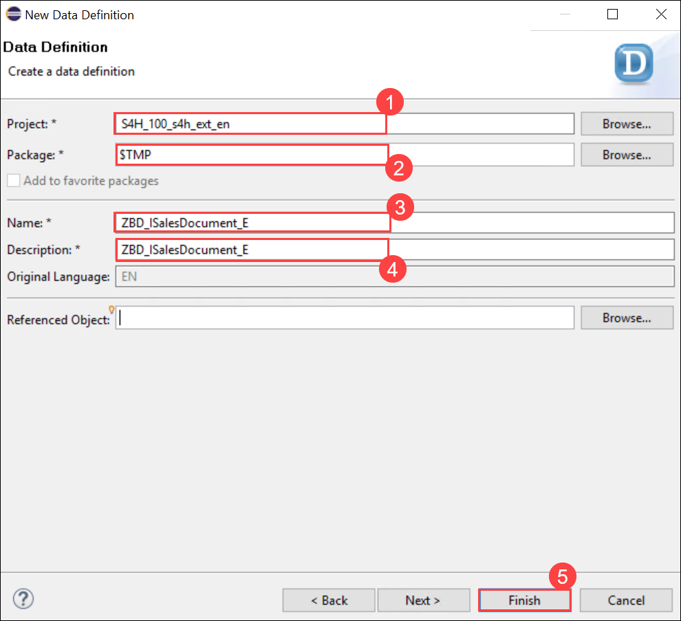

12. Replace the code listing for **ZBD_ISALESDOCUMENT_E** with the following. Save the file.

    ```SAP
    @AbapCatalog.sqlViewName: 'ZBD_ISALESDOC_E'
    @AbapCatalog.compiler.compareFilter: true
    @AbapCatalog.preserveKey: true
    @AccessControl.authorizationCheck: #CHECK
    @EndUserText.label: 'Expanded CDS for Extraction I_Salesdocument'
    define view ZBD_I_Salesdocument_E as select from I_SalesDocument {
    key SalesDocument,
        //Category
        SDDocumentCategory,
        SalesDocumentType,
        SalesDocumentProcessingType,

        CreationDate,
        CreationTime,
        LastChangeDate,
        //@Semantics.systemDate.lastChangedAt: true
        LastChangeDateTime,

        //Organization
        SalesOrganization,
        DistributionChannel,
        OrganizationDivision,
        SalesGroup,
        SalesOffice,
        
        //SoldTo
        SoldToParty,
        _SoldToParty.CustomerName,
        _SoldToParty.Country,
        _SoldToParty.CityName,
        _SoldToParty.PostalCode,
        _SoldToParty.CustomerAccountGroup,
        
        //SalesDistrict
        SalesDistrict,
        
        CustomerGroup,
        CreditControlArea,
        PurchaseOrderByCustomer,
        
        //Pricing
        TotalNetAmount,
        TransactionCurrency,
        PricingDate,
        //RetailPromotion,
        //PriceDetnExchangeRate,
        //SalesDocumentCondition,
        
        //Billing
        BillingDocumentDate,
        BillingCompanyCode
    } where SDDocumentCategory = 'C'
    ```

13. Right-click in the whitespace of the **ZBD_ISALESDOCUMENT_E** view code window and select **Activate**.

    

14. Right-click in the whitespace of the **ZBD_ISALESDOCUMENT_E** view once more, this time select **Open With** and choose **Data Preview**. This will display the raw data of the view.

    

    

15. Keep this file open for the next task.

### Task 2: Expose SAP sales data as an OData service

1. Add the following code immediately preceding the `define view` line of code of the **ZBD_ISALESDOCUMENT_E** file and save the file.

    ```ABAL
    @OData.publish: true
    ```

    

2. Right-click in the whitespace of the **ZBD_ISALESDOCUMENT_E** file, and select **Activate**.

3. Minimize the Eclipse development environment, and double-click the **SAP Logon** icon located on the desktop of the virtual machine. This will open the SAP GUI application.

    

4. From the top toolbar menu, select the **Logon** button.

    

5. Log in with the username `S4H_EXT` and the password `Welcome1`, press <kbd>Enter</kbd> to submit the form.

    

6. Once logged on, type `/n/IWFND/MAINT_SERVICE` in the toolbar menu transaction combo box and press <kbd>Enter</kbd>. This opens the **Activate and Maintain Services** window.

      

7. From the toolbar menu of the **Activate and Maintain Services** window, select the **Add Service** button.

    

8. Populate the **Add Selected Services** filter form as follows and press <kbd>Enter</kbd>.

    | Field | Value |
    |-------|-------|
    | System Alias | Enter `Local`. |
    | Technical Service Name | Enter `ZBD_*`. |

    

9. From the list of results, select the **ZBD_I_SALESDOCUMENT_E_CDS** item.

    

10. In the **Add Service** dialog, select the **Local Object** button located in the **Creation Information** section. This will populate the **$TMP** value, and press <kbd>Enter</kbd>. An information dialog indicating success will display, dismiss this dialog.

    

11. On the **Add Selected Services** screen, select the **Back** button on the toolbar menu. This will open the **Activate and Maintan Services** window once more.

    

12. On the **Activate and Maintain Services** screen, select the **Filter** button from the toolbar menu.

    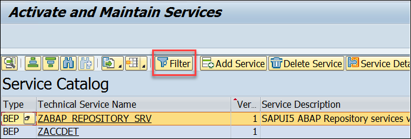

13. In the **Filter for Service Catalog** dialog, type `ZBD_*` in the **Technical Service Name** field and press <kbd>Enter</kbd>.

    

14. This action filters the **Activate and Maintain Services** screen to a single service. In the **ICF Nodes** pane, select the **SAP Gateway Client** button. If the **SAP GUI Security** dialog displays, check the **Remember My Decision** checkbox and select **Allow**.

    

15. On the **SAP Gateway Client** window, select the **Execute** button from the toolbar menu. This tests the OData service. Verify in the **HTTP Response** pane that the status code indicates **200**.

    

16. On the **SAP Gateway Client** window, select the **EntitySets** button on the toolbar menu.

    

17. On the **EntitySets** dialog, double-click the **ZBD_I_Salesdocument_E** item.

     

18. On the **SAP Gateway Client** window, select **Execute**. This service retrieves the sales documents via the OData endpoint. Verify the HTTP Response status code value is **200**.

    

19. On the **SAP Gateway Client** window, select the **Back** button to return to the **Activate and Maintain Services** screen.

20. On the **ICF Node** pane, select the **Call Browser** button. This will bring up the **Security GUI** dialog once more. Copy the URL value for future use in the lab. After recording the value, close the dialog. This URL is the service endpoint for the sales document OData service.

    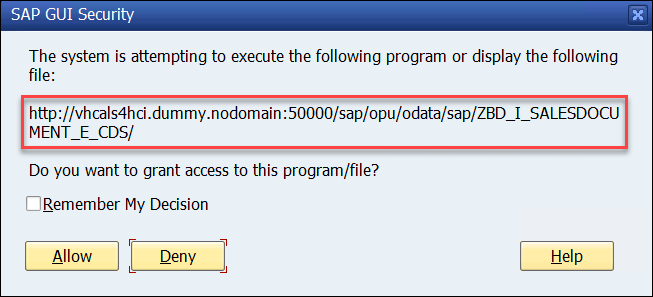


## Exercise 2: Prepare payment data in Cosmos DB

Duration: X minutes

Raw payment data is available in Azure Data Lake storage. This exercise walks through loading raw payment data into Cosmos DB by leveraging Azure Synapse Analytics. First, linked services are created - these act as the connection strings to external compute resources. Next, integration datasets are created, these indicate the location and shape of the data being used in the migration. Finally, a pipeline is created to orchestrate moving data from Azure Data Lake Storage Gen2 to Cosmos DB.

### Task 1: Create linked services in Azure Synapse Analytics

1. In the [Azure Portal](https://portal.azure.com), open the **mcw_sap_plus_extend_and_innovate** resource group.

2. From the list of resources, locate and select the Synapse Workspace item named **sapdatasynws{SUFFIX}**.

    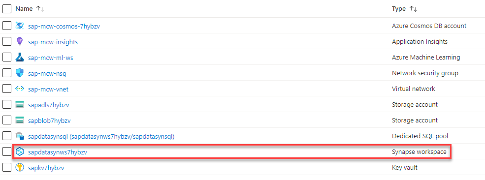

3. On the Synapse workspace screen, select **Open Synapse Studio**.

    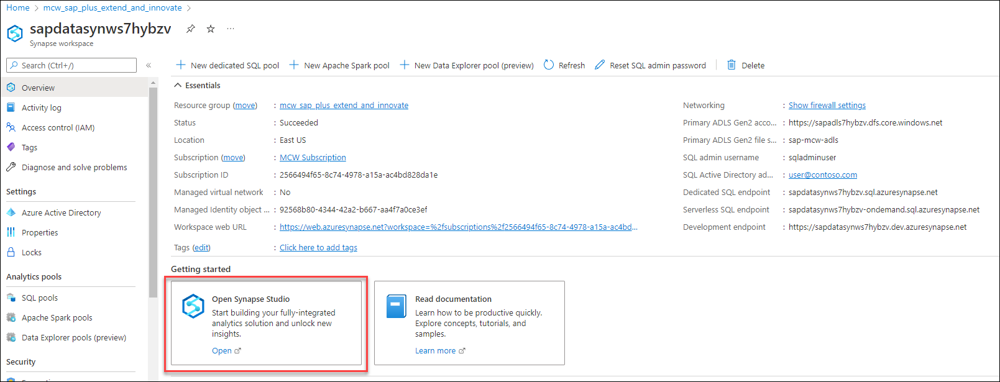

4. In Synapse Studio, select the **Manage** hub from the left menu.

    

5. Beneath the **External connections** section, select **Linked services**. Then select **+ New** from the Linked services toolbar menu.

    

6. In the New linked service blade, search for and select **Azure Data Lake Storage Gen2**. Select **Continue**.

      

7. In the New linked service - Azure Data Lake Storage Gen2 form, fill it in as follows and select **Create**. Unspecified fields retain their default values.
    
    | Field | Value |
    |-------|-------|
    | Name | Enter `datalake`. |
    | Authentication type | Select **System Assigned Managed Identity**. |
    | Azure subscription | Select your Azure subscription. |
    | Storage account name | Select **sapadls{SUFFIX}**. |

    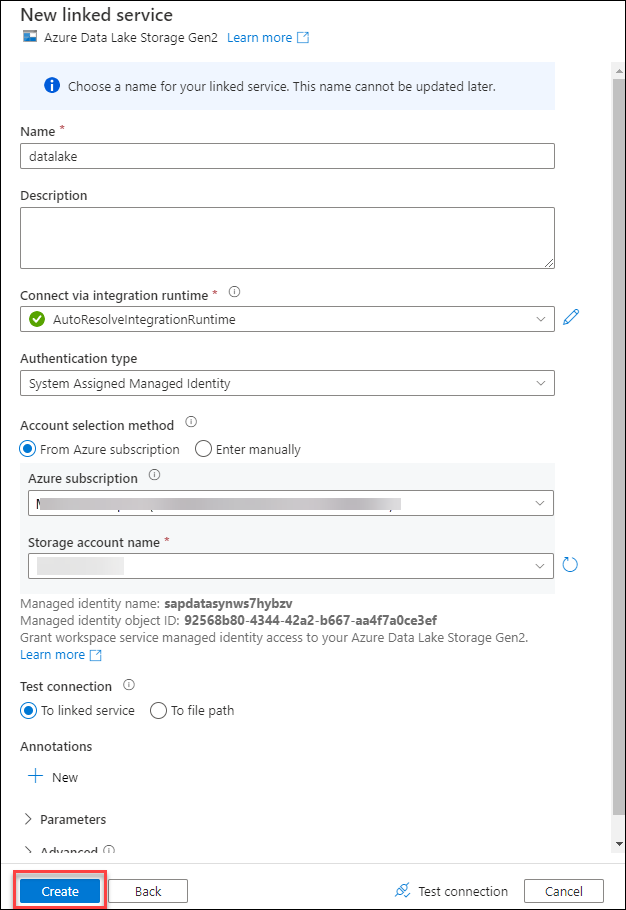

8. On the Linked services screen, select **+ New** from the toolbar menu. On the New Linked service blade search for and select **Azure Cosmos DB (SQL API)**. Select **Continue**.

    

9. In the New linked service - Azure Cosmos DB form, fill it as follows then select the **Create** button. Unspecified fields retain their default values.
    
    | Field | Value |
    |-------|-------|
    | Name | Enter `payment_data_cosmosdb`. |
    | Authentication type | Select **Account key**. |
    | Azure subscription | Select your Azure subscription. |
    | Azure Cosmos DB account name | Select **sap-mcw-cosmos-{SUFFIX}**. |
    | Database name | Select **SAPS4D**. |

    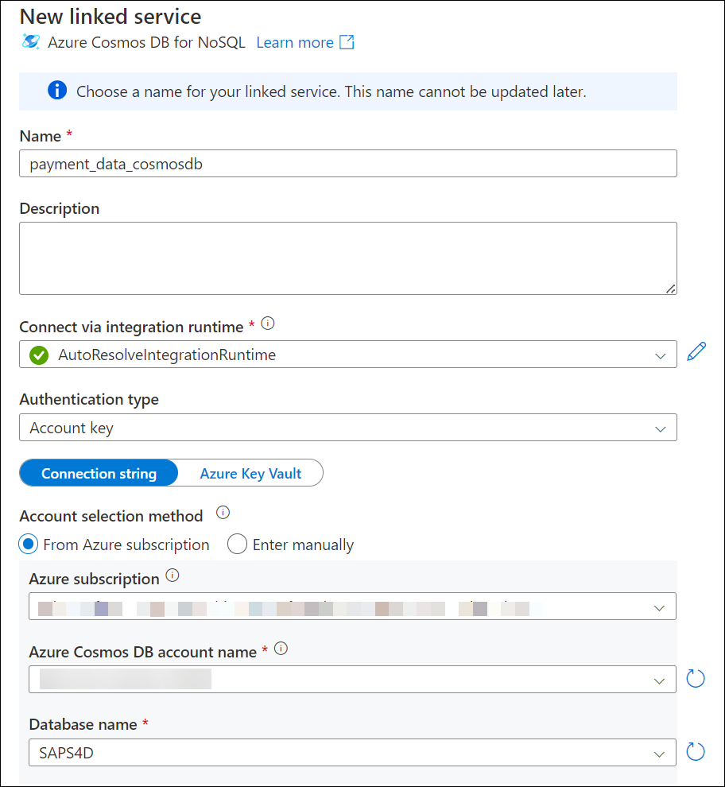

10. On the Synapse Studio toolbar menu, select **Publish all**. Select **Publish** on the verification blade.

    

### Task 2: Create source and sink integration datasets

The source data is payment data that is located in Azure Data Lake Storage Gen2 in CSV format. The sink is the paymentData Cosmos DB collection.

1. In Synapse Studio, select the **Data** hub.
   
   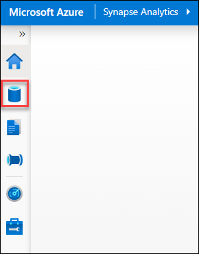

2. From the center pane, select the **Linked** tab. Expand the **Azure Data Lake Storage Gen2** item, followed by teh **datalake** item, and select the **payment-data-csv** container. From the **payment-data-csv** tab, select the **paymentData_CAL2021.csv** file. Next, select **New integration dataset** from the toolbar menu.

    

3. On the New integration dataset blade, enter `payment_data_csv` for the name and select **DelimitedText** for the format. Select **Create**.

    

4. On the **payment-data-csv** integration dataset tab, change the **Column delimiter** value to **Semicolon (;)** and check the checkbox for the **First row as header** field.
   
   

5. If desired, select the **Preview data** button to view a sample of the data.

6. Remaining in the Data hub, expand the **+** menu in the center pane and select **Integration dataset** beneath the **Linked** header.

    

7. On the New integration dataset blade, search for and select **Azure Cosmos DB (SQL API)**. Select **Continue**.

    

8. On the **Set properties** blade, fill the form as follows, then select **OK**.

    | Field | Value |
    |-------|-------|
    | Name | Enter `payments_cosmosdb`. |
    | Linked service | Select **payment_data_cosmosdb**. |
    | Container | Select **paymentData**. |
    | Import schema | Select **None**. |

    

9. On the Synapse Studio toolbar menu, select **Publish all**. Select **Publish** on the verification blade.

    

### Task 3: Create pipeline to ingest payment data into Cosmos DB

1. In Synapse Studio, select the **Integrate** hub from the left menu. Then from the center pane menu, expand the **+** button and choose **Pipeline**.

    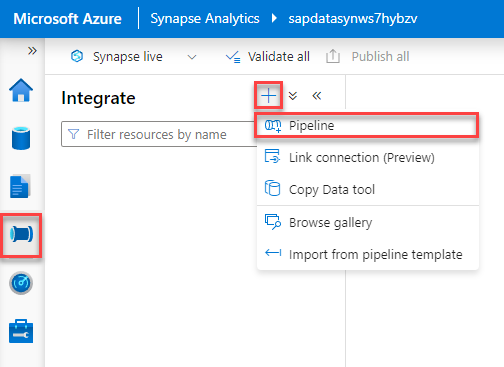

2. In the **Properties** blade of the new pipeline, set the name field to **UploadPaymentsToCosmosDB**. If desired, press the **Properties** button in the pipeline toolbar to collapse this blade.

    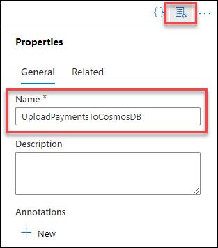

3. In the Activities pane, expand the **Move & Transform** item then drag and drop a **Copy data** activity to the pipeline canvas.

    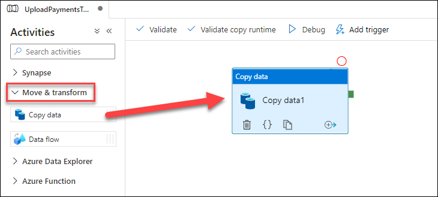

4. With the Copy data activity selected in the pipeline editor, select the **Source** tab. Select **payment_data_csv** as the **Source dataset**.

    

5. With the Copy data activity selected in the pipeline editor, select the **Sink** tab. Select **payments_cosmosdb** as the Sink dataset.

    

6. On the Synapse Studio toolbar menu, select **Publish all**. Select **Publish** on the verification blade.

    

7. Once published, expand the **Add trigger** toolbar item and choose **Trigger now**. Select **OK** on the Pipeline run blade. This will run the pipeline to copy the payments data to Cosmos DB.

    

8. In Synapse Studio, select the **Monitor** hub. Beneath the Integration header of the center pane, select **Pipeline runs**. Monitor the payments pipeline run until it has completed. The Refresh button in the toolbar may be used to update the monitoring table.

    

9. Verify the data by returning to the Azure Portal, opening the **mcw_sap_plus_extend_and_innovate** resource group, then locating and opening the **sap-mcw-cosmos-{SUFFIX}** Cosmos DB resource.

    

10. On the Azure Cosmos DB account screen, select **Data Explorer** from the left menu. In the SQL API panel, expand the **SAPS4D** and **paymentData** items. Select **Items**, then choose an item from the **paymentData** tab. This will display the contents of the selected document for review.

    
 
## Exercise 3: Install the self-hosted integration runtime on the SAP virtual machine

In order for Azure Synapse Analytics to utilize the locally hosted OData services on the 
SAP virtual machine, a self-hosted integration runtime must be installed. The self-hosted integration runtime is used to establish connectivity between Azure Synapse Analytics and other non-public internet facing compute resources. These can be on-premises resources or those protected by virtual networks and firewalls.

### Task 1: Download and install the self-hosted integration runtime

1. On the **SAP VM**, open the Chrome browser and log into the [Azure Portal](https://portal.azure.com). 

2. Open the **mcw_sap_plus_extend_and_innovate** resource group then locate and open the **sapdatasynws{SUFFIX}** Synapse workspace resource.

3. Open Synapse Studio.

4. Select the **Manage** hub, then choose **Integration runtimes** from beneath the Integration header. From the Integration runtimes screen, select **+ New** from the toolbar menu.

    

5. On the Integration runtime setup blade, select the **Azure, Self-Hosted** card. Select **Continue**.

    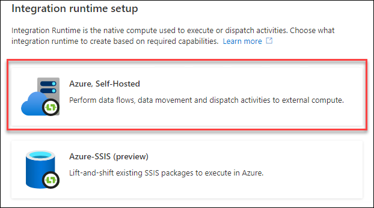

6. Select **Self-Hosted** as the network environment. Select **Continue**.

      

7. Enter `SAPVM-SHIR` in the Name field and select **Create**.

    

8. Select the link below the **Option 1: Express setup** header. This will download an executable file.

    

9. Run the downloaded executable. The Express Setup will download, install, and register the self-hosted integration runtime. Select the **Close** button once all the steps have completed.

    

10. Close the Integration runtime setup blade.

11. The Integration runtimes list should now display **SAPVM-SHIR** in the list.

    

12. Optionally close Chrome and minimize the SAP VM.

## After the hands-on lab 

Duration: X minutes

\[insert your custom Hands-on lab content here . . .\]

### Task 1: Task name

1.  Number and insert your custom workshop content here . . .

    -  Insert content here

        -  

### Task 2: Task name

1.  Number and insert your custom workshop content here . . .

    -  Insert content here

        -    

You should follow all steps provided *after* attending the Hands-on lab.

