<div class="MCWHeader1">
SAP plus extend and innovate
</div>

<div class="MCWHeader2">
Hands-on lab step-by-step
</div>

<div class="MCWHeader3">
May 2022
</div>


Information in this document, including URL and other Internet Web site references, is subject to change without notice. Unless otherwise noted, the example companies, organizations, products, domain names, e-mail addresses, logos, people, places, and events depicted herein are fictitious, and no association with any real company, organization, product, domain name, e-mail address, logo, person, place or event is intended or should be inferred. Complying with all applicable copyright laws is the responsibility of the user. Without limiting the rights under copyright, no part of this document may be reproduced, stored in or introduced into a retrieval system, or transmitted in any form or by any means (electronic, mechanical, photocopying, recording, or otherwise), or for any purpose, without the express written permission of Microsoft Corporation.

Microsoft may have patents, patent applications, trademarks, copyrights, or other intellectual property rights covering subject matter in this document. Except as expressly provided in any written license agreement from Microsoft, the furnishing of this document does not give you any license to these patents, trademarks, copyrights, or other intellectual property.

The names of manufacturers, products, or URLs are provided for informational purposes only and Microsoft makes no representations and warranties, either expressed, implied, or statutory, regarding these manufacturers or the use of the products with any Microsoft technologies. The inclusion of a manufacturer or product does not imply endorsement of Microsoft of the manufacturer or product. Links may be provided to third party sites. Such sites are not under the control of Microsoft and Microsoft is not responsible for the contents of any linked site or any link contained in a linked site, or any changes or updates to such sites. Microsoft is not responsible for webcasting or any other form of transmission received from any linked site. Microsoft is providing these links to you only as a convenience, and the inclusion of any link does not imply endorsement of Microsoft of the site or the products contained therein.

© 2022 Microsoft Corporation. All rights reserved.

Microsoft and the trademarks listed at <https://www.microsoft.com/en-us/legal/intellectualproperty/Trademarks/Usage/General.aspx> are trademarks of the Microsoft group of companies. All other trademarks are property of their respective owners.

**Contents** 

<!-- TOC -->
- [SAP plus extend and innovate hands-on lab step-by-step](#sap-plus-extend-and-innovate-hands-on-lab-step-by-step)
  - [Abstract and learning objectives](#abstract-and-learning-objectives)
  - [Overview](#overview)
  - [Solution architecture](#solution-architecture)
  - [Requirements](#requirements)
  - [Before the hands-on lab](#before-the-hands-on-lab)
  - [Exercise 1: Install the self-hosted integration runtime on the SAP virtual machine](#exercise-1-install-the-self-hosted-integration-runtime-on-the-sap-virtual-machine)
    - [Task 1: Download and install the self-hosted integration runtime](#task-1-download-and-install-the-self-hosted-integration-runtime)
  - [Exercise 2: Ingest sales order information from SAP into Azure Synapse Analytics](#exercise-2-ingest-sales-order-information-from-sap-into-azure-synapse-analytics)
    - [Task 1: Create dedicated SQL pool tables to hold sales data](#task-1-create-dedicated-sql-pool-tables-to-hold-sales-data)
    - [Task 2: Create a linked service to the SAP OData endpoint for sales order header information](#task-2-create-a-linked-service-to-the-sap-odata-endpoint-for-sales-order-header-information)
    - [Task 3: Create a linked service to the SAP OData endpoint for sales order item information](#task-3-create-a-linked-service-to-the-sap-odata-endpoint-for-sales-order-item-information)
    - [Task 4: Create a linked service to the dedicated SQL pool database](#task-4-create-a-linked-service-to-the-dedicated-sql-pool-database)
    - [Task 5: Create integration datasets for sales order header and sales order items](#task-5-create-integration-datasets-for-sales-order-header-and-sales-order-items)
    - [Task 6: Create a pipeline to ingest sales data from S/4HANA](#task-6-create-a-pipeline-to-ingest-sales-data-from-s4hana)
  - [Exercise 3: Ingest payment information from Cosmos DB into Azure Synapse Analytics](#exercise-3-ingest-payment-information-from-cosmos-db-into-azure-synapse-analytics)
    - [Task 1: Create a dedicated SQL pool table to hold payment information](#task-1-create-a-dedicated-sql-pool-table-to-hold-payment-information)
    - [Task 2: Create the Payments table integration dataset](#task-2-create-the-payments-table-integration-dataset)
    - [Task 3: Create the Payments ingestion pipeline](#task-3-create-the-payments-ingestion-pipeline)
  - [Exercise 4: Visualize historical data with Power BI](#exercise-4-visualize-historical-data-with-power-bi)
    - [Task 1: Retrieve the database connection information for the dedicated SQL pool](#task-1-retrieve-the-database-connection-information-for-the-dedicated-sql-pool)
    - [Task 2: Import data into Power BI](#task-2-import-data-into-power-bi)
    - [Task 3: Create the relational model](#task-3-create-the-relational-model)
    - [Task 4: Create a sales per data and customer group visualization](#task-4-create-a-sales-per-data-and-customer-group-visualization)
    - [Task 5: Create a sales per region and customer group visualization](#task-5-create-a-sales-per-region-and-customer-group-visualization)
    - [Task 6: Create a payments per date and customer group visualization](#task-6-create-a-payments-per-date-and-customer-group-visualization)
    - [Task 7: Create a sales per customer group and material group visualization](#task-7-create-a-sales-per-customer-group-and-material-group-visualization)
    - [Task 8: Create a payment offset per customer group visualization](#task-8-create-a-payment-offset-per-customer-group-visualization)
    - [Task 9: Create a payment offset per customer group box plot visualization (Optional)](#task-9-create-a-payment-offset-per-customer-group-box-plot-visualization-optional)
  - [Exercise 4: Create a machine learning model to predict incoming cashflow](#exercise-4-create-a-machine-learning-model-to-predict-incoming-cashflow)
    - [Task 1: Create a linked service to the Azure Machine Learning workspace](#task-1-create-a-linked-service-to-the-azure-machine-learning-workspace)
    - [Task 1: Create a SQL view that combines sales orders with payments data](#task-1-create-a-sql-view-that-combines-sales-orders-with-payments-data)
  - [After the hands-on lab](#after-the-hands-on-lab)
    - [Task 1: Task name](#task-1-task-name)
    - [Task 2: Task name](#task-2-task-name)

<!-- /TOC -->

# SAP plus extend and innovate hands-on lab step-by-step 

## Abstract and learning objectives 

In this hands-on lab you will:

1. **Extract** (historical) Sales Orders from SAP S/4HANA using Azure Synapse Analytics pipelines

2. **Extract** historical payments from a non-SAP system, in this case Cosmos DB using Azure Synapse Analytics pipelines

3. **Visualize** the extracted Sales Orders and invoice data with Power BI

4. **Predict** incoming cash flow for Sales Orders using Azure Machine Learning

5. **Trigger actions** in SAP based on insights gained from the prediction model

## Overview

When customers buy goods, the corresponding payments are not completed immediately. Some customers will pay directly while other customers will pay at the end of their payment terms. This makes it difficult for companies to predict the incoming cashflow. In this lab, Azure tooling is used to predict the incoming cashflow. To predict cash flow, historical Sales Orders and payments data is required. Contoso Retail also needs a way to flag risky customers in the SAP system whose payments tend to arrive late.

## Solution architecture


 Sales Order information is stored in an S/4HANA system and payments data is stored in Cosmos DB. Synapse Pipelines are used to ingest historical data from both sources. Power BI is used to visualize historical data and to create reports. Azure Machine Learning is used to create a model to predict incoming cash flow. Finally, a data alert is established to identify risky payers whose payments are typically late. This alert triggers a Power Automate process that will in-turn flag the risky payers in SAP.

## Requirements

1.  Azure Subscription with Owner role

2.  SAP CAL account

3.  Power Platform account or membership in the [Microsoft 365 Developer Program](https://developer.microsoft.com/microsoft-365/dev-program)

4.  [Power BI Desktop](https://powerbi.microsoft.com/desktop/)

## Before the hands-on lab

Refer to the Before the hands-on lab setup guide manual before continuing to the lab exercises.
 
## Exercise 1: Install the self-hosted integration runtime on the SAP virtual machine

In order for Azure Synapse Analytics to utilize the locally hosted OData services on the 
SAP virtual machine, a self-hosted integration runtime must be installed. The self-hosted integration runtime is used to establish connectivity between Azure Synapse Analytics and other non-public internet facing compute resources. These can be on-premises resources and those protected by virtual networks and firewalls.

### Task 1: Download and install the self-hosted integration runtime

1. On the **SAP VM**, open the Chrome browser and log into the [Azure Portal](https://portal.azure.com). 

2. Open the **mcw_sap_plus_extend_and_innovate** resource group then locate and open the **sapdatasynws{SUFFIX}** Synapse workspace resource.

3. Open Synapse Studio.

4. Select the **Manage** hub, then choose **Integration runtimes** from beneath the Integration header. From the Integration runtimes screen, select **+ New** from the toolbar menu.

    

5. On the Integration runtime setup blade, select the **Azure, Self-Hosted** card. Select **Continue**.

    

6. Select **Self-Hosted** as the network environment. Select **Continue**.

      

7. Enter `SAPVM-SHIR` in the Name field and select **Create**.

    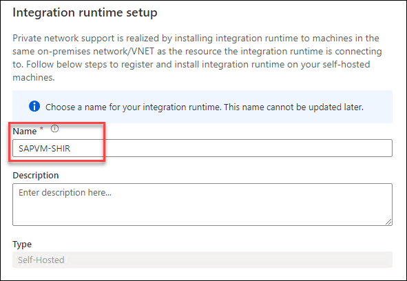

8. Select the link below the **Option 1: Express setup** header. This will download an executable file.

    

9. Run the downloaded executable. The Express Setup will download, install, and register the self-hosted integration runtime. Select the **Close** button once all the steps have completed.

    

10. Close the Integration runtime setup blade.

11. The Integration runtimes list should now display **SAPVM-SHIR** in the list.

    

12. Optionally close Chrome and minimize the SAP VM.

## Exercise 2: Ingest sales order information from SAP into Azure Synapse Analytics

Historical sales order information resides in S/4HANA and is exposed with OData services. The self-hosted integration runtime installed on the SAP virtual machine enables connectivity between Azure Synapse Analytics and S/4HANA, this will allow for local web calls to take place to the OData endpoints to retrieve sales data.

### Task 1: Create dedicated SQL pool tables to hold sales data

1. In Synapse Studio, select the **Develop** hub from the left menu, then expand the **+** menu from the center pane and choose **SQL script**.

    

2. In the SQL script tab, choose to connect to the **sapdatasynsql** dedicated SQL pool in the toolbar menu.

    

3. In the SQL script editor, paste and run the following SQL command to create the SalesOrderHeaders table. The **Run** button is located in the SQL script toolbar menu.

    ```SQL
    CREATE TABLE SalesOrderHeaders(
        BILLINGCOMPANYCODE nvarchar(4),
        BILLINGDOCUMENTDATE date,
        COUNTRY nvarchar(3),
        CREATIONDATE date,
        CREATIONTIME time,
        CREDITCONTROLAREA nvarchar(4),
        CUSTOMERACCOUNTGROUP nvarchar(4),
        CUSTOMERGROUP nvarchar(2),
        CUSTOMERNAME nvarchar(80),
        DISTRIBUTIONCHANNEL nvarchar(2),
        LASTCHANGEDATE date,
        LASTCHANGEDATETIME datetimeoffset,       
        ORGANIZATIONDIVISION nvarchar(2),
        PRICINGDATE date,
        PURCHASEORDERBYCUSTOMER nvarchar(35),
        SALESDISTRICT nvarchar(6),
        SALESDOCUMENT nvarchar(10) NOT NULL,
        SALESDOCUMENTPROCESSINGTYPE nvarchar(1),
        SALESDOCUMENTTYPE nvarchar(4),
        SALESGROUP nvarchar(3),
        SALESOFFICE nvarchar(4),
        SALESORGANIZATION nvarchar(4),
        SDDOCUMENTCATEGORY nvarchar(4),
        SOLDTOPARTY nvarchar(10),
        TOTALNETAMOUNT decimal(15, 2),
        TRANSACTIONCURRENCY nvarchar(5),
        CITYNAME nvarchar(35),
        POSTALCODE nvarchar(10)
    )
    ```

4. Replace the code in the script window with the following command to create the SalesOrderItems table. Run this script.

    ```SQL
    CREATE TABLE SalesOrderItems(
        SalesOrder nvarchar(10),
        SalesOrderItem nvarchar(6),
        SalesOrderItemText nvarchar(40),
        SoldToParty nvarchar(10),
        MaterialByCustomer nvarchar(35),
        MaterialName nvarchar(40),
        Material nvarchar(40),
        ShipToParty nvarchar(10),
        FullName nvarchar(80),
        SDProcessStatus nvarchar(1),
        DeliveryStatus nvarchar(1),
        SDDocumentRejectionStatus nvarchar(1),
        SalesDocumentRjcnReason nvarchar(2),
        RequestedQuantity decimal(15,3),
        RequestedQuantityUnit nvarchar(3),
        TransactionCurrency nvarchar(5),
        NetAmount decimal(16, 3),
        MaterialGroup nvarchar(9),
        Batch nvarchar(10),
        ProductionPlant nvarchar(4),
        StorageLocation nvarchar(4),
        ShippingPointName nvarchar(30),
        ShippingPoint nvarchar(4),
        SalesOrderItemCategory nvarchar(4),
        BillingBlockCriticality tinyint,
        ItemBillingBlockReason nvarchar(2),
        OrderRelatedBillingStatus nvarchar(1),
        RequestedDeliveryDate date,
        HigherLevelItem nvarchar(6),
        SalesOrderProcessingType nvarchar(1),
        RequirementSegment nvarchar(40)
    )
    ```

### Task 2: Create a linked service to the SAP OData endpoint for sales order header information

A linked service describes connectivity to external resources. In this case, an authenticated OData-based linked service is required to pull sales order data from SAP.

1. In Synapse Studio, select the **Manage** hub, then choose **Linked services** from the center menu. Select **+ New** in the Linked services screen toolbar menu.

    

2. In the New linked service blade, search for and select **OData**. Select **Continue**.

    

4. Fill the New linked service form as follows, then test connection. Select **Create**.

    | Field | Value |   
    |-------|-------|
    | Name | Enter `sap_salesorderheader_odata`. |
    | Connect via integration runtime | Select **SAPVM-SHIR**. |
    | Service URL | Use the SAP OData URL recorded in the Before the hands-on lab steps. |
    | Authentication type | Select **Basic authentication**. |
    | User name | Enter `S4H_EXT`. |
    | Password | Enter `Welcome1`. |
    
    

### Task 3: Create a linked service to the SAP OData endpoint for sales order item information

1. In Synapse Studio, select the **Manage** hub, then choose **Linked services** from the center menu. Select **+ New** in the Linked services screen toolbar menu.

    

2. In the New linked service blade, search for and select **OData**. Select **Continue**.

    

4. Fill the New linked service form as follows, then test connection. Select **Create**.

    | Field | Value |   
    |-------|-------|
    | Name | Enter `sap_salesorderitems_odata`. |
    | Connect via integration runtime | Select **SAPVM-SHIR**. |
    | Service URL | Use the SAP OData URL recorded in the from the Before the hands-on lab steps. Replace **ZBD_I_SALESDOCUMENT_E_CDS** with `sd_f1814_so_fs_srv` in the URL value. |
    | Authentication type | Select **Basic authentication**. |
    | User name | Enter `S4H_EXT`. |
    | Password | Enter `Welcome1`. |
    
    

### Task 4: Create a linked service to the dedicated SQL pool database

1. In Synapse Studio, select the **Manage** hub, then choose **Linked services** from the center menu. Select **+ New** in the Linked services screen toolbar menu.

    

2. In the New linked service blade, search for and select **Azure Synapse Analytics**. Select **Continue**.

    

3. In the New linked service Azure Synapse Analytics blade, populate the form as follows then select **Create**.
    
    | Field | Value |   
    |-------|-------|
    | Name | Enter `sales_order_data_sql`. |
    | Azure subscription | Select the Azure subscription for the lab. |
    | Server name | Select **sapdatasynws{SUFFIX}**. |
    | Database name | Select **sapdatasynsql**. |
    | Authentication type | Select **System Assigned Managed Identity**. |

    

4. On the Synapse Studio toolbar menu, select **Publish all**. Select **Publish** on the verification blade.

    

### Task 5: Create integration datasets for sales order header and sales order items

The Copy activity in Azure Synapse Analytics requires the usage of integration datasets to describe both the source and sink data sources. In this task, four integration datasets are defined representing sales order headers and sales order item data (source in S/4HANA OData and sink in dedicated SQL pool tables).

1. In Synapse Studio, select the **Data** hub from the left menu and expand the **+** menu in the center pane. Select **Integration dataset**.

    

2. In the New integration dataset blade, search for and select **OData**

    

3. On the **Set properties** blade, fill the form as follows and select **OK**. This will create the integration dataset representing sales order header information.

    | Field | Value |   
    |-------|-------|
    | Name | Enter `sales_order_headers_odata`. |
    | Linked service | Select **sap_salesorderheader_odata**. |
    | Path | Select **ZBD_I_Salesdocument_E**. |

    

4. Repeat steps 1 and 2 to create a new integration dataset. On the **Set properties** blade, fill the form as follows and select **OK**. This creates the integration dataset for sales item information.

    | Field | Value |   
    |-------|-------|
    | Name | Enter `sales_order_items_odata`. |
    | Linked service | Select **sap_salesorderitems_odata**. |
    | Path | Select **C_Salesorderitemfs**. |

    

5. Now it is time to create the integration datasets for the sales order tables created in the dedicated SQL pool. In Synapse Studio, select the **Data** hub from the left menu and expand the **+** menu in the center pane. Select **Integration dataset**.

    

6. In the New integration dataset blade, search for and select **Azure Synapse Analytics**. Select **Continue**.

    

7. On the **Set properties** blade, populate the form as follows and select **OK**.

    | Field | Value |   
    |-------|-------|
    | Name | Enter `sales_order_headers_sql`. |
    | Linked service | Select **sales_order_data_sql**. |
    | Table name | Select **dbo.SalesOrderHeaders**. |
    | Import schema | Select **From connection/store**. |

    

8. Repeat steps 5 and 6 to create a new Azure Synapse Analytics integration dataset. On the **Set properties** blade, populate the form as follows and select **OK**.

    | Field | Value |   
    |-------|-------|
    | Name | Enter `sales_order_items_sql`. |
    | Linked service | Select **sales_order_data_sql**. |
    | Table name | Select **dbo.SalesOrderItems**. |
    | Import schema | Select **From connection/store**. |

    

9. On the Synapse Studio toolbar menu, select **Publish all**. Select **Publish** on the verification blade.

    

### Task 6: Create a pipeline to ingest sales data from S/4HANA

An Azure Synapse Analytics pipeline can be used to move data from source to sink. The Copy data activity moves data from a source dataset to a sink dataset. This task creates a pipeline with two Copy data activities to move sales order header and sales order items data from S/4HANA into the dedicated SQL pool tables in Azure Synapse Analytics.

1. In Synapse Studio, select the **Integrate** hub from the left menu. Expand the **+** menu from the center pane, and choose **Pipeline**.

    

2. In the Properties blade, enter the name `IngestSalesOrderData`. Optionally collapse the Properties blade using the button on the toolbar of the pipeline.

    

3. From the Activities menu, expand the **Move & transform** section, then drag-and-drop a **Copy data** activity to the pipeline visual canvas. With the Copy data activity selected, enter `copy_sales_order_headers` in the **Name** field.

    

4. With the **copy_sales_order_headers** activity selected, select the **Source** tab. In the **Source dataset** tab, select **sales_order_headers_odata**.

    

5. With the **copy_sales_order_headers** activity selected, select the **Sink** tab. Select **sales_order_headers_sql** as the Sink dataset, and **PolyBase** as the **Copy method**.

    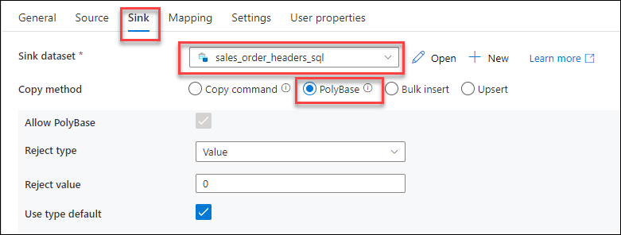

6. With the **copy_sales_order_headers** activity selected, select the **Mapping** tab. Select the **Import schemas** button to review the data mapping.

    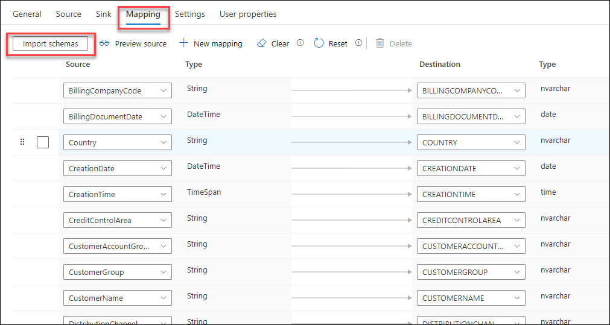

7. With the **copy_sales_order_headers** activity selected, select the **Settings** tab. Check the **Enable staging** checkbox, then select **datalake** for the **Staging account linked service** and enter `staging` in the **Storage Path** field.

    

8. Drag-and-drop another instance of the Copy data activity to the pipeline visual canvas. On the **General** tab enter `copy_sales_order_items`.
   
     

9.  With the **copy_sales_order_items** activity selected, select the **Source** tab. In the **Source dataset** tab, select **sales_order_items_odata**.

    

10. With the **copy_sales_order_items** activity selected, select the **Sink** tab. In the **Sink dataset** tab, select **sales_order_items_sql**.

    

11. With the **copy_sales_order_items** activity selected, select the **Mapping** tab. Select the **Import schemas** button to review the mapping of the data fields.

    

12. With the **copy_sales_order_items** activity selected, select the **Settings** tab. Check the **Enable staging** checkbox, then select **datalake** for the **Staging account linked service** and enter `staging` in the **Storage Path** field.

    

13. On the Synapse Studio toolbar menu, select **Publish all**. Select **Publish** on the verification blade.

    

14. Once published, expand the **Add trigger** item on the pipeline toolbar and select **Trigger now**. Select **OK** on the Pipeline run blade.
    
    

15. On the left menu of Synapse Studio, select the **Monitor** hub. Ensure **Pipeline runs** is selected from the center menu. Observe the IngestSalesOrderData pipeline status over time. Use the **Refresh** button to update the table.

    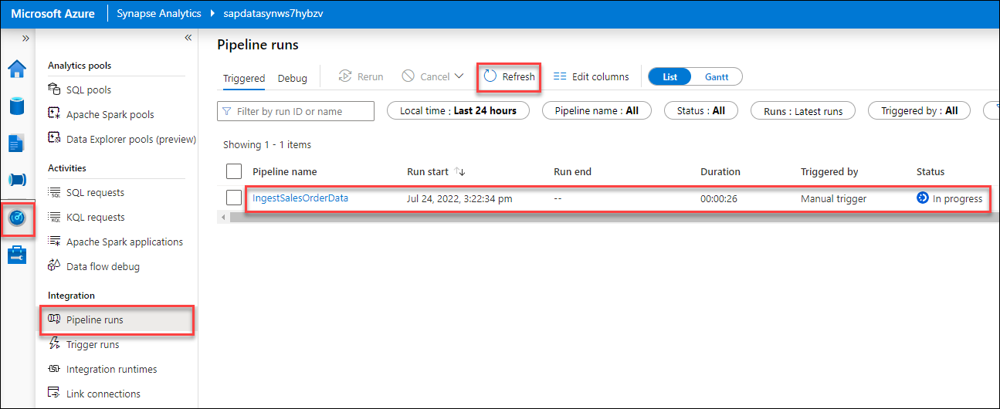

16. Upon successful completion of the pipeline run, verify data was copied by accessing the **Develop** hub from the left menu, expanding the **+** menu and selecting **SQL script**. In the **Connect to** field of the SQL script, select **sapdatasynsql**. In the query window, paste the following SQL commands and run the queries.

    ```sql
    select count(*) from SalesOrderHeaders;
    select count(*) from SalesOrderItems;
    ```

17. Toggle the **Select** drop down to view the results of each query executed. Ensure the values for each query are non-zero.

      

## Exercise 3: Ingest payment information from Cosmos DB into Azure Synapse Analytics

Payment history data is required when creating the cash flow prediction model. This data resides in Cosmos DB. In this exercise, a pipeline is created to move payment history data from a Cosmos DB collection into a table in a dedicated SQL pool in Azure Synapse Analytics. In the steps taken in the Before the hands-on lab steps, a linked service for Cosmos DB (payment_data_cosmosdb) and an integration dataset for the paymentData collection (payments_cosmosdb) were created. These assets will be reused in this exercise to implement the payment ingestion pipeline.

### Task 1: Create a dedicated SQL pool table to hold payment information

1. In Synapse Studio, select the **Develop** hub from the left menu, then expand the **+** menu from the center pane and choose **SQL script**.

    

2. In the SQL script tab, choose to connect to the **sapdatasynsql** dedicated SQL pool.

    

3. In the SQL script editor, paste and run the following SQL command to create the Payments table. The Run button is located in the SQL script toolbar menu.

    ```SQL
    CREATE TABLE Payments(
        PaymentNr nvarchar(10),
        SalesOrderNr nvarchar(10),
        CustomerNr nvarchar(10),
        CustomerName nvarchar(80),
        PaymentDate date,
        PaymentValue decimal(15,2),
        Currency nvarchar(5)
    )
    ```
### Task 2: Create the Payments table integration dataset

1. In Synapse Studio, select the **Data** hub from the left menu and expand the **+** menu in the center pane. Select **Integration dataset**.

    

2. In the New integration dataset blade, search for and select **Azure Synapse Analytics**. Select **Continue**.

    

7. On the **Set properties** blade, populate the form as follows and select **OK**.

    | Field | Value |   
    |-------|-------|
    | Name | Enter `payments_sql`. |
    | Linked service | Select **sales_order_data_sql**. |
    | Table name | Select **dbo.Payments**. |
    | Import schema | Select **From connection/store**. |

    

8. On the Synapse Studio toolbar menu, select **Publish all**. Select **Publish** on the verification blade.

    

### Task 3: Create the Payments ingestion pipeline

1. In Synapse Studio, select the **Integrate** hub from the left menu. Expand the **+** menu from the center pane, and choose **Pipeline**.

    

2. In the Properties blade, enter the name `IngestPaymentsData`. Optionally collapse the Properties blade using the button on the toolbar of the pipeline.

    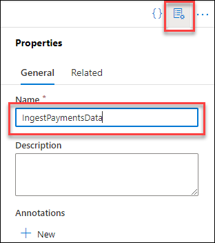

3. From the Activities menu, expand the **Move & transform** section then drag-and-drop a **Copy data** activity to the pipeline visual canvas. With the Copy data activity selected, enter **copy_payments_data** in the **Name** field.

    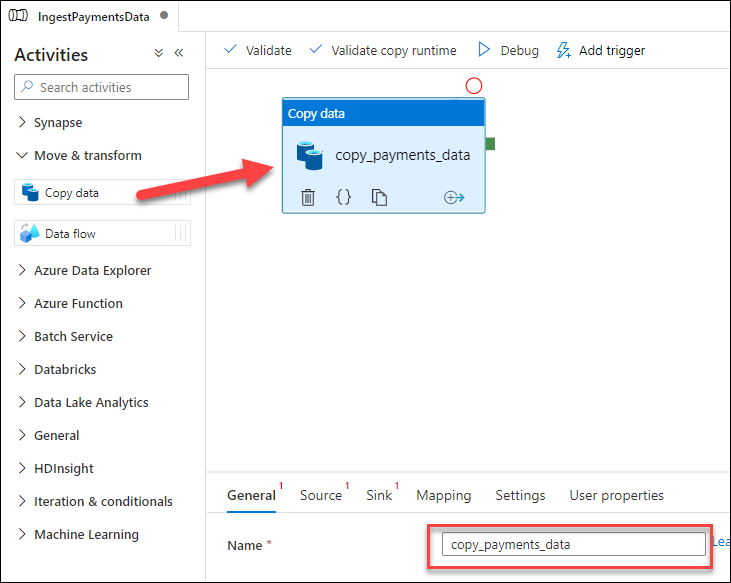

4. With the **copy_payments_data** Copy data activity selected, select the **Source** tab. Select **payments_cosmosdb** as the **Source dataset**.

    

5. With the **copy_payments_data** Copy data activity selected, select the **Sink** tab. Select **payments_sql** as the Sink dataset.

    

6. With the **copy_payments_data** Copy data activity selected, select the **Mapping** tab. Select the **Import schemas** button.

    

7. On the Mapping tab, locate the field with the name **Value**, and use the dropdown to assign it to the Column name **PaymentValue**. Uncheck the **Include** checkboxes for the **id** field as well as all the fields whose name is prefixed with and underscore (_).

    

8. With the **copy_payments_data** Copy data activity selected, select the **Settings** tab. Check the **Enable staging** checkbox, then select **datalake** for the **Staging account linked service** and enter `staging` in the **Storage Path** field.

    

9. On the Synapse Studio toolbar menu, select **Publish all**. Select **Publish** on the verification blade.

    

10. Once published, expand the **Add trigger** item on the pipeline toolbar and select **Trigger now**. Select **OK** on the Pipeline run blade.
    
    

11. On the left menu of Synapse Studio, select the **Monitor** hub. Ensure **Pipeline runs** is selected from the center menu. Observe the IngestPaymentsData pipeline status over time. Use the **Refresh** button to update the table.

    
    

12. Upon successful completion of the pipeline run, verify data was copied by accessing the **Develop** hub from the left menu, expanding the **+** menu and selecting **SQL script**. In the **Connect to** field of the SQL script, select **sapdatasynsql**. In the query window, paste the following SQL command and run the query. Ensure the value returned is non-zero.

    ```sql
    select count(*) from Payments;
    ```

## Exercise 4: Visualize historical data with Power BI

Contoso Retail would like to gain insights into historical sales order and payments data.

### Task 1: Retrieve the database connection information for the dedicated SQL pool

1. In Synapse Studio, open the **Manage** hub from the left menu, choose **SQL pools** from the center menu and select the **sapdatasynsql** dedicated SQL pool from the list.

    

2. On the Properties blade, record the values for the **Name** and **Workspace SQL endpoint** fields.

    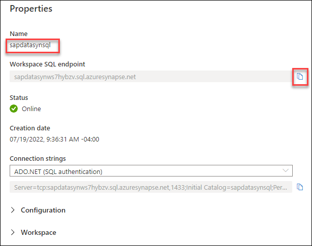

### Task 2: Import data into Power BI

1. Open **Power BI Desktop**. On the splash screen, select the **Get Data** item.
   
    

2. On the Get Data dialog, select **Azure** from the left menu and select **Azure Synapse Analytics SQL** from the listing. Select the **Connect** button.
   
    

3. On the SQL Server database dialog, populate the form as follows and select **OK**.

    | Field | Value |   
    |-------|-------|
    | Server | Enter the **Workspace SQL endpoint** value recorded in the previous task. |
    | Database | Enter the **Name** value recorded in the previous step. |
    | Data Connectivity mode | Select **Import**. |

    

4. An authentication dialog displays, select **Microsoft account** from the left menu, then select the **Sign in** button. Authenticate with your Azure credentials.

    

5. Once signed in, select the **Connect** button on the dialog.

6. On the Navigator dialog, check the box next to all three tables, then select the **Transform Data** button.

    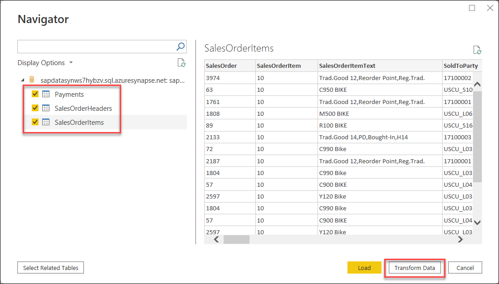

7. The columns in the tables representing sales order numbers were incorrectly interpreted as strings by Power BI. In the Power Query editor screen, select **SalesOrderItems** from the Queries pane, then right-click on the **SalesOrder** field and expand the **Change Type** item and choose **Whole Number**.

    

8. Repeat the previous step, this time changing the type of the following table columns to Whole Number.

    | Table (Queries pane) | Column |   
    |-------|-------|
    | SalesOrderHeaders | SALESDOCUMENT |
    | Payments | SalesOrderNr |

9. Select **Close & Apply** in the Power Query editor toolbar.

    

### Task 3: Create the relational model

1. From the left menu, select the **Model** item. This will switch to the Model view.

    

2. On the Model design canvas, drag the SALESDOCUMENT field from the SalesOrderHeaders table and drop it on the SalesOrder field of the SalesOrderItems table. This establishes a one-to-many relationship (1:*) between the tables.

    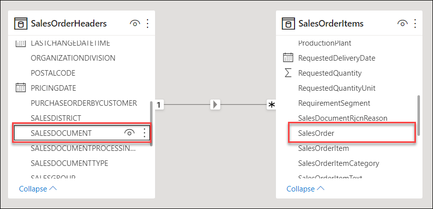

3. On the Model design canvas, drag the SalesOrderNr field from the Payments table and drop it on the SALESDOCUMENT field in the SalesOrderHeaders table. This establishes a one-to-one relationship (1:1) between the tables.
   
   
   
### Task 4: Create a sales per data and customer group visualization

1. In the Visualizations pane, select **Stacked column chart**. 

2. From the **Fields** pane, drag-and-drop the SalesOrderHeaders.CREATIONDATE field to the X-axis box, the SalesOrderHeaders.TOTALNETAMOUNT field to the Y-axis box and the SalesOrderHeaders.CUSTOMERGROUP field to the Legend box. 

    

3. Adjust the sizing of the chart on the report canvas as desired.

    

### Task 5: Create a sales per region and customer group visualization

1. In the Visualizations pane, select **Map**. 

2. From the **Fields** pane, drag-and-drop the SalesOrderHeaders.CITYNAME field to the Location box, the SalesOrderHeaders.CUSTOMERGROUP field to the Legend box and the SalesOrderHeaders.TOTALNETAMOUNT to the Bubble size box. 

   

    > **Note**: Map visuals are disabled by default, access File -> Options and Settings -> Options -> Global - Security to enable. After updating Options in Power BI, you may need to close and reopen the report for the settings change to take effect.
    > 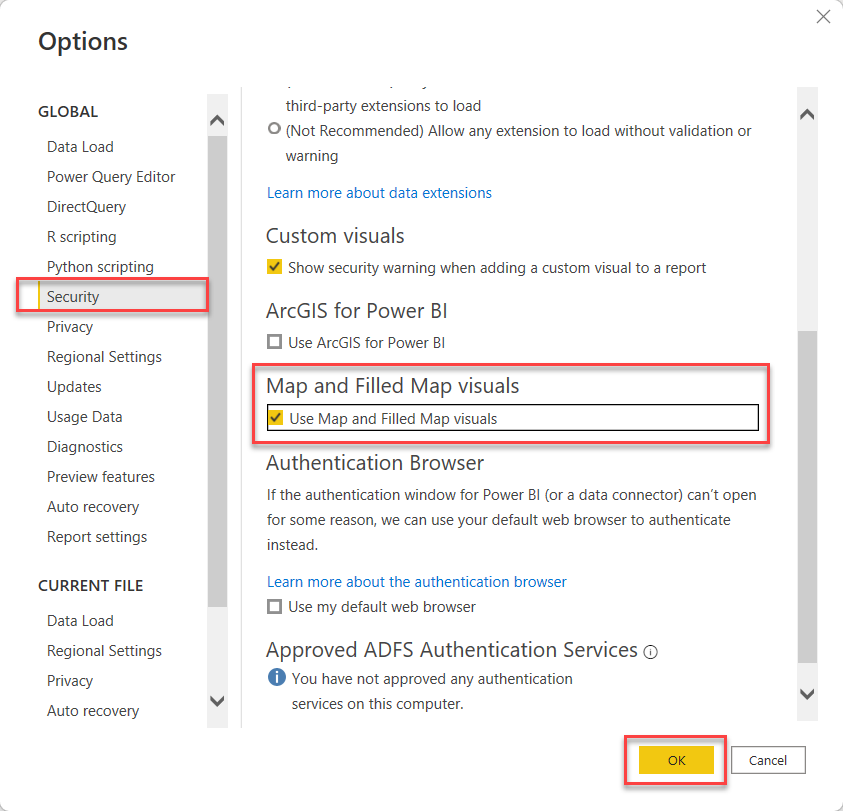

3. Adjust the sizing and zoom of the map on the report canvas as desired.

    

### Task 6: Create a payments per date and customer group visualization

1. In the Visualizations pane, select **Stacked Column Chart**.

2. From the **Fields** pane, drag-and-drop the Payments.PaymentDate field to the X-axis box, the Payments.PaymentValue field to the Y-axis box and the SalesOrderHeaders.CUSTOMERGROUP field to the Legend box. 
   
    

3.  Adjust the sizing of the chart on the report canvas as desired.

    

### Task 7: Create a sales per customer group and material group visualization

1. In the Visualizations pane, select **Stacked Bar Chart**.

2. From the **Fields** pane, drag-and-drop the SalesOrderHeaders.CUSTOMERGROUP field to the Y-axis box, the SalesOrderItems.NetAmount field to the Y-axis box and the SalesOrderItems.MaterialGroup field to the Legend box. 
   
    

3.  Adjust the sizing of the chart on the report canvas as desired.

    

### Task 8: Create a payment offset per customer group visualization

This report shows the average number of days by which each customer group pays their SalesOrders. Afterwards a comparison can be made with the outcome of the Machine Learning Model built in the next exercise. SalesOrderHeaders and the Payment data are combined to calculate the number of days between the billing date and the payment date.

1. In Power BI Desktop, expand the **Transform data** item on Home tab toolbar menu. Select **Transform data**.
   
   

2. In the Power Query Editor window, select the **SalesOrderHeaders** table from the Queries pane, and expand the **Merge Queries** option on the Home toolbar menu. Select the **Merge Queries as New** option.

  

3. In the Merge window, select the SALESDOCUMENT column of the SalesOrderHeaders table. Select the **Payments** table as the second table, and select the SalesOrderNr field. Select **OK**.

    

4. Rename the Merge query by right-clicking the Merge query in the Queries pane, and selecting **Rename**. Name the merged query **SalesOrderPayments**.

5. With the SalesOrderPayments query selected, scroll the table completely to the right. Expand the **Payments** column menu, and choose to include the following fields: **PaymentNr**, **PaymentDate**, **PaymentValue** and **Currency**. Select **OK**.

    

6. Select **Close & Apply** in the Power Query editor toolbar.

    

7. From the report designer, expand the **Transform data** item on Home tab toolbar menu. Select **Transform data**.
   
   

8. In the Power Query Editor window, select the **SalesOrderPayments** table from the Queries pane. A new column is required to calculate the difference between the billing date and the actual payment data. Select the **Add Column** tab and select the **Custom Column** button on the toolbar menu.

    

9. In the Custom Column window, enter `Offset` for the New column name. In the Custom column formula field, enter the following formula. Select **OK**.

    ```vb
    Duration.Days([PaymentDate] - [BILLINGDOCUMENTDATE])
    ```

    

10. In the table, right-click on the newly created Offset field and expand the **Change Type** option. Select **WholeNumber** to convert this column to integer.

    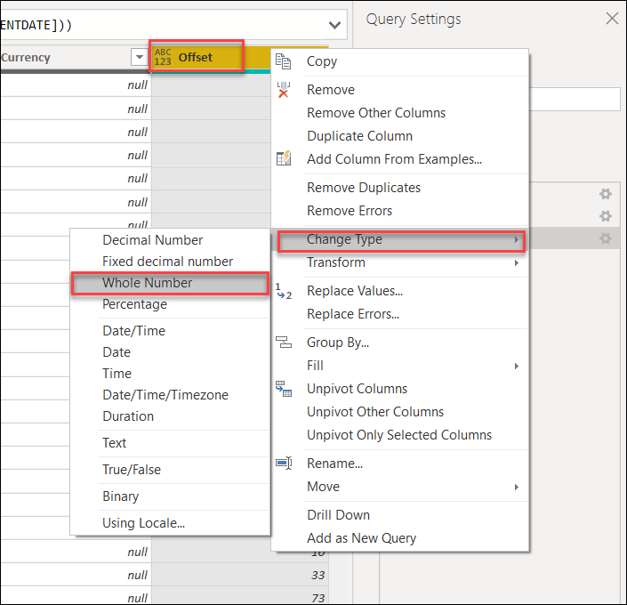
   
11. Return to the Home tab and select **Close & Apply** in the Power Query editor toolbar.

    

12. On the report canvas, add a **Stacked Column** chart. Drag-and-drop the SalesOrderPayments.CUSTOMERGROUP to the X-axis box and SalesOrderPayments.Offset to the Y-axis box. Expand the chevron menu next to the Offset column and choose to report the **Average**.

    

13. Adjust the sizing of the chart on the report canvas as desired.

    

### Task 9: Create a payment offset per customer group box plot visualization (Optional)

A box plot can provide a more detailed view of the payment offset by customer group data.

1. In the Visualizations pane, expand the ellipsis menu and select **Get more visuals**.

    

2. On the Power BI visuals window, search for **Box and Whisker**. Then choose the **Box and Whisker chart** by DataScenarios.

    

3. On the AppSource window, select the **Add** button to add the Box and Whisker chart.

    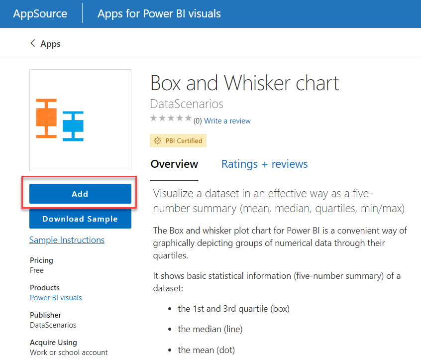

4. On the Visualizations pane, select the newly added **Box and Whisker** chart. In the Category field, drag-and-drop the SalesOrderPayments.CUSTOMERGROUP, SalesOrderPayments.Offset into the Sampling field, and SalesOrderPayments.Offset into the Value field. Expand the chevron menu in the Value field and select the **Average** option.

    

5. Adjust the sizing of the chart on the report canvas as desired.

    

    > **Note**: From this diagram you can see that:
    > - CustomerGroup1 pays within 70 days +/- 10 days
    > - CustomerGroup2 pays within 30days +/- 5 days
    > - Other customergroups pay after 10 days

## Exercise 4: Create a machine learning model to predict incoming cashflow

Contoso Retail would like to take advantage of the historical sales order and payment data to create a machine learning model that predicts incoming cashflow.

### Task 1: Create a SQL view that combines sales orders with payments data

1. In Synapse Studio, select the **Develop** hub from the left menu, then expand the **+** menu from the center pane and choose **SQL script**.

    

2. In the SQL script tab, choose to connect to the **sapdatasynsql** dedicated SQL pool in the toolbar menu.

    

3. In the SQL script editor, paste and run the following SQL command to create the SalesPaymentsFull view that joins the SalesOrderHeaders and Payments data. The **Run** button is located in the SQL script toolbar menu.
   
   ```SQL
   CREATE VIEW [dbo].[SalesPaymentsFull]
        AS SELECT s.[SALESDOCUMENT]
        , s.[CUSTOMERNAME]
        , s.[CUSTOMERGROUP]
        , s.[BILLINGCOMPANYCODE]
        , s.[BILLINGDOCUMENTDATE]
        , p.[PaymentDate] as PAYMENTDATE
        , s.[CUSTOMERACCOUNTGROUP]
        , s.[CREDITCONTROLAREA]
        , s.[DISTRIBUTIONCHANNEL]
        , s.[ORGANIZATIONDIVISION]
        , s.[SALESDISTRICT]
        , s.[SALESGROUP]
        , s.[SALESOFFICE]
        , s.[SALESORGANIZATION]
        , s.[SDDOCUMENTCATEGORY]
        , s.[CITYNAME]
        , s.[POSTALCODE]
        , DATEDIFF(dayofyear, s.BILLINGDOCUMENTDATE, p.PaymentDate) as PAYMENTDELAYINDAYS
    FROM [dbo].[SalesOrderHeaders] as s
    JOIN [dbo].[Payments] as p ON REPLACE(LTRIM(REPLACE(s.[SALESDOCUMENT], '0', ' ')), ' ', '0') = p.[SalesOrderNr]
   ```


## After the hands-on lab 

Duration: X minutes

\[insert your custom Hands-on lab content here . . .\]

### Task 1: Task name

1.  Number and insert your custom workshop content here . . .

    -  Insert content here

        -  

### Task 2: Task name

1.  Number and insert your custom workshop content here . . .

    -  Insert content here

        -    

You should follow all steps provided *after* attending the Hands-on lab.

