## Exercise 10: Update SAP from Power BI

Duration: 30 minutes

Contoso Retail also needs a way to flag risky customers in the SAP system whose payments tend to arrive late. In this exercise, a Power Automate flow is added in the Power BI report that initiates a business partner update in SAP using OData.

### Task 1: Import a Power Automate flow

1. In a web browser, access the following link and select the download icon to download the UpdateBusinessPartnerFromPowerBI.zip file. This file contains the exported flow that is used in this exercise.

    ```text
    https://github.com/microsoft/MCW-SAP-plus-extend-and-innovate-with-data-and-ai/blob/main/Hands-on%20lab/Resources/powerautomate/UpdateBusinessPartnerFromPowerBI.zip
    ```

    

2. Access and log into [Power Automate](https://make.powerautomate.com).

3. From the left menu, select **My flows**. Expand the **Import** menu item on the toolbar menu and select **Import Package (Legacy)**.

    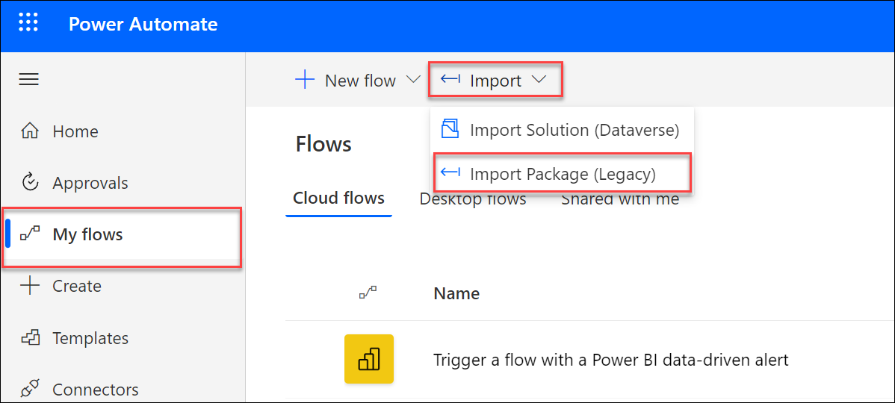

4. On the Import package screen, select the **Upload** button then choose to upload the file that was downloaded in the first step of this task: **UpdateBusinessPartnerFromPowerBI.zip**. The file will automatically start uploading.

    

5. In the Import package review screen, select the wrench icon next to the Power BI Connection under the Related resources section.

   

6. On the Import Setup blade, choose the Power BI user account utilized during this lab and select **Save**.

    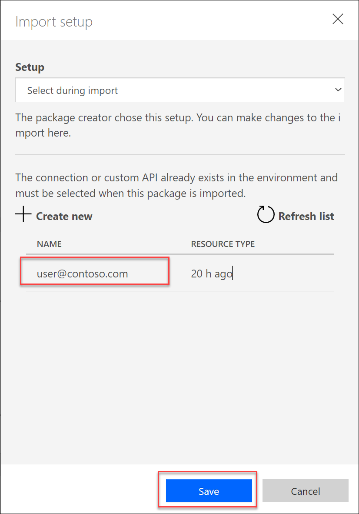

7. Select **Import** to complete the import of the flow.

    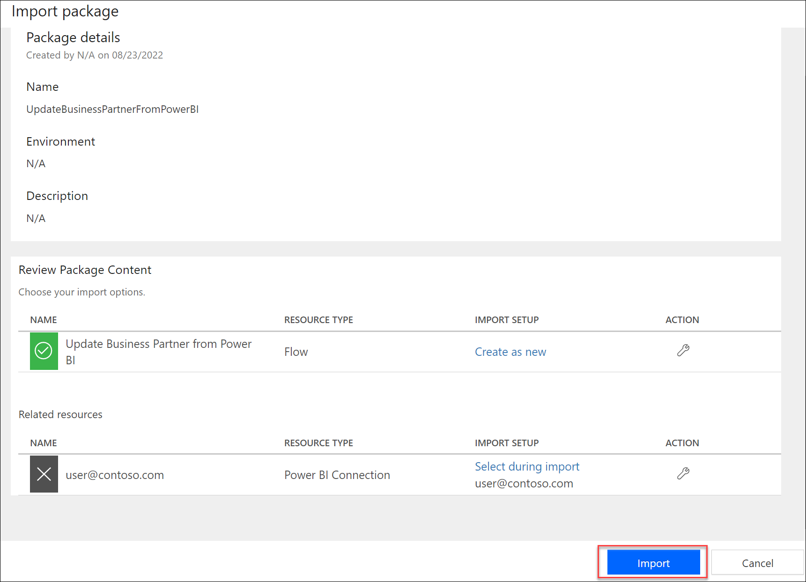

8. A message indicating the successful import will display at the top of the screen. Select the **Open flow** link from this message.

    

9. On the flow design canvas, expand the second step **Initialize variable** and replace the Value field with the IP address of the MCWSAP-SAP1 virtual machine. Select **Save** from the toolbar menu. Refer to the Before the hands-on lab Task 5 steps 15 and 16 for guidance.

    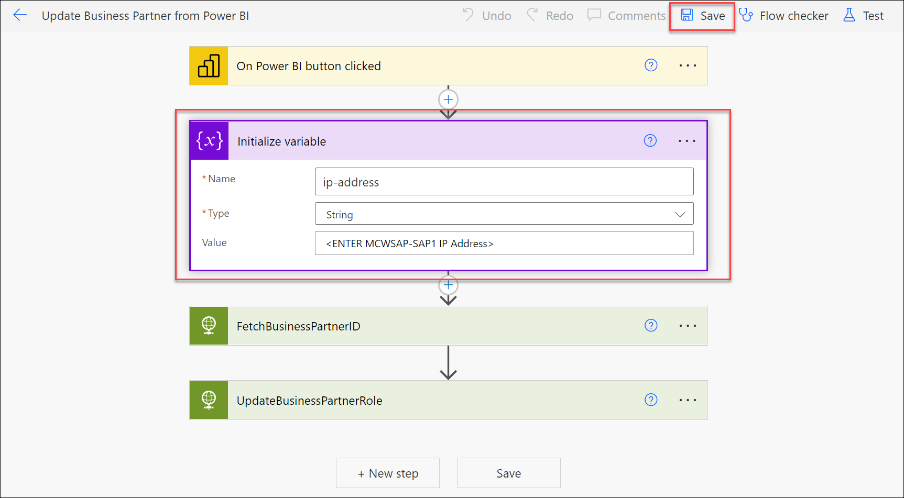

    >**Note**: This flow initiates a get request to the SAP service to retrieve a business partner by name using the CUSTOMERNAME value passed in by Power BI. This request also requests an X-CSRF-Token that will allow the current session to perform an update. The last HTTP call issues the update of the business partner record found in the first HTTP activity to 02, indicating a risky customer.

10. Select the back arrow icon next to the Update Business Partner from Power BI title in the toolbar.

    

11. On the Flows &gt; Update Business Partner from Power BI screen, select **Turn on** from the toolbar menu.

    

12. Keep this screen open for a future task.

### Task 2: Add a Power Automate visual and trigger the flow from Power BI

1. Access and log into [Power BI](https://app.powerbi.com).

2. Open the report from the earlier exercises, under **My workspace**.

3. In the online Power BI report editor in the web browser, select the **Edit** button from the top toolbar menu.

    

4. From the Visualizations panel, select the **Table** item. Drag-and-drop the SalesOrderPayments.CUSTOMERNAME to the Columns box.

   

5. Ensure no other visualization is selected, then choose the **Power Automate** item from the Visualizations panel. Drag-and-drop the SalesOrderPayments.CUSTOMERNAME to the Power Automate data box.

    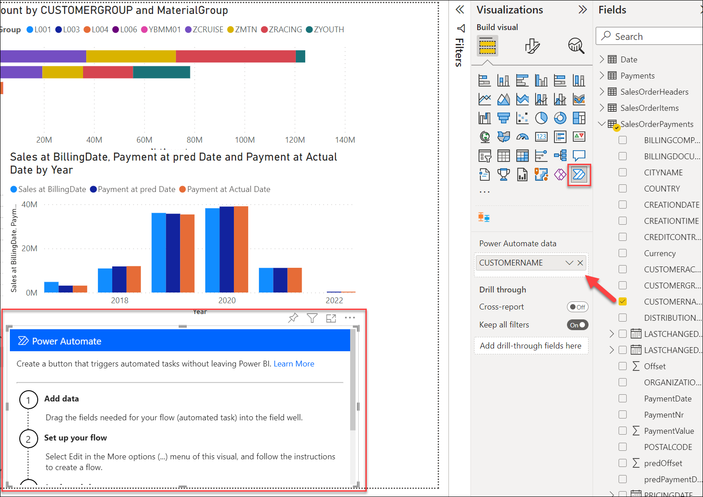

6. Expand the ellipsis menu on the Power Automate visualization on the report and select **Edit**.

    

7. On the Microsoft Power Automate screen, select the **Update Business Partner from Power BI** flow then choose **Apply** on the toolbar menu. Once applied, select the **Back to report** link at the top of the screen.

   

8. Select **Save** then **Reading view** from the report toolbar menu.

    

9. Switch to the Postman application, issue the **GET Customer** request from the SAP MCW collection. Refer to the Before the hands-on-lab step 17 through 21 for guidance if necessary. Make note that in the response, the **BusinessPartnerRole** indicates **01** for **Bigmart** - this indicates a customer in good standing.

    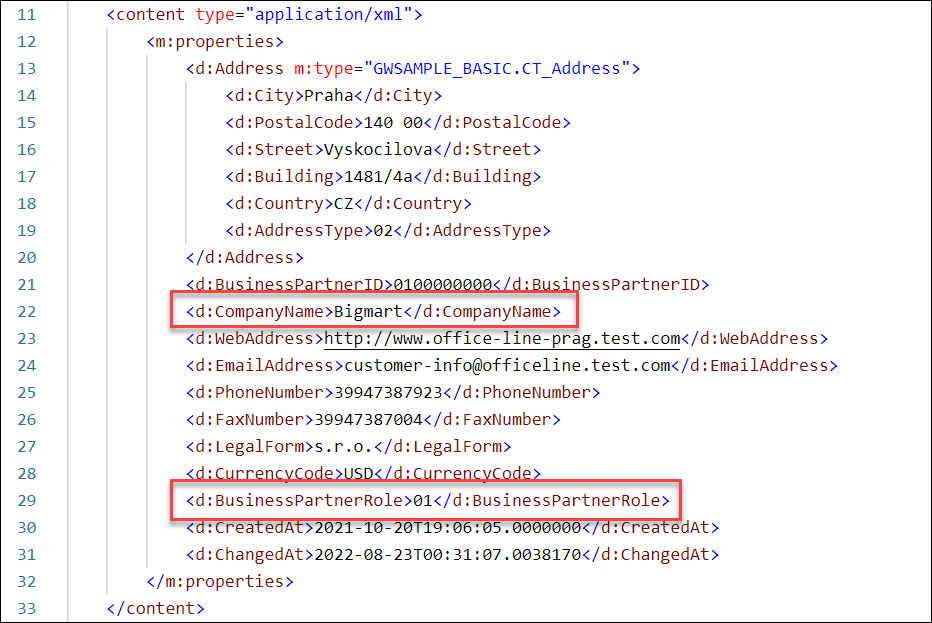

10. Switch back to the Power BI report, from the CUSTOMERNAME table, select **Bigmart**. This will filter the report visualizations by that customer.

    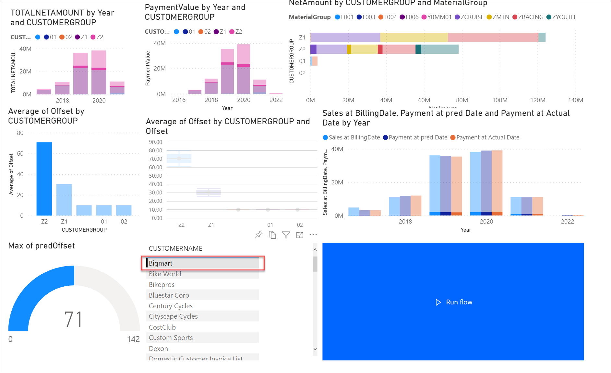

11. Select the **Run flow** button (anywhere in the blue area), and the Update Business Partner from Power BI flow will be triggered.

    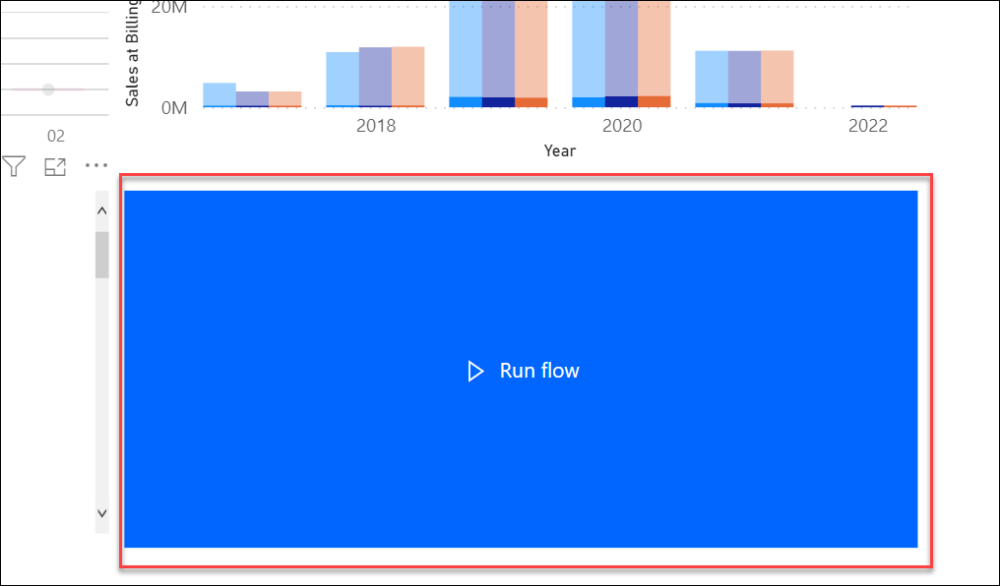

12. Return to the Power Automate Update Business Partner from Power BI flow screen (left open in Task 1). The history displays the status of the run as succeeded. Optionally, drill into the Date link beneath the Start header to view the run details.

    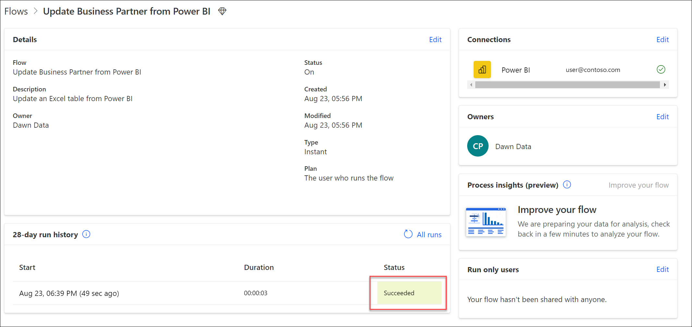

13. Switch back to the Postman application, issue the **GET Customer** request from the SAP MCW collection. Notice how the BusinessPartnerRole value now indicates **02**. This role indicates this customer is now flagged as a risky customer in SAP.

    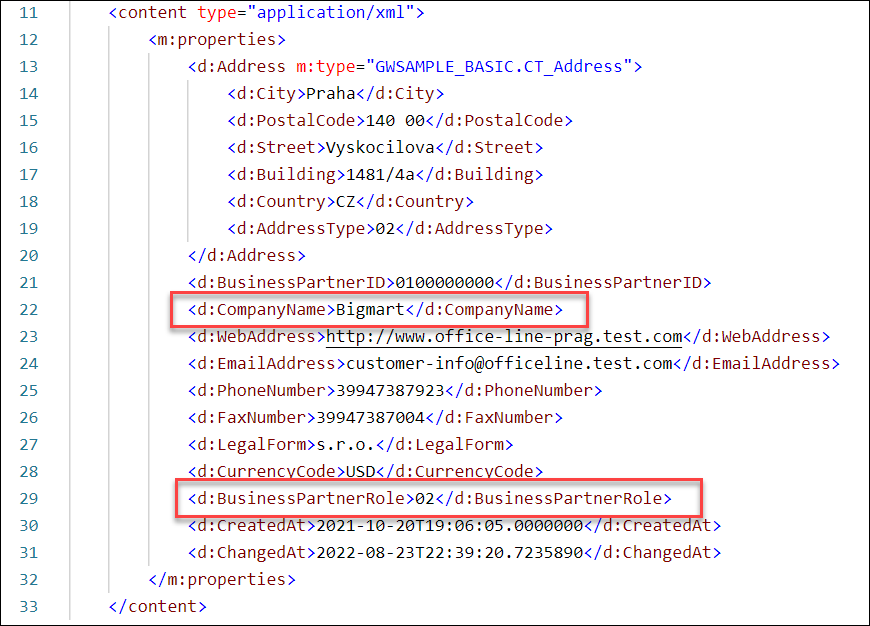

## After the hands-on lab

Duration: 10 minutes

### Task 1: Delete the Power Automate flows

1. In Power Automate, select **My flows** locate the **Trigger a flow with a Power BI data-driven alert** item, expand the ellipsis menu and choose **Delete**.

   

2. Repeat the previous step to delete the **Update Business Partner from Power BI** flow.

### Task 2: Delete the Power BI workspace report and dataset

1. In the Power BI workspace, select **My workspace** from the left menu to get a listing of items. Delete the report, dataset, and the Alerting dashboard items by expanding the ellipsis menu and choosing Delete.

    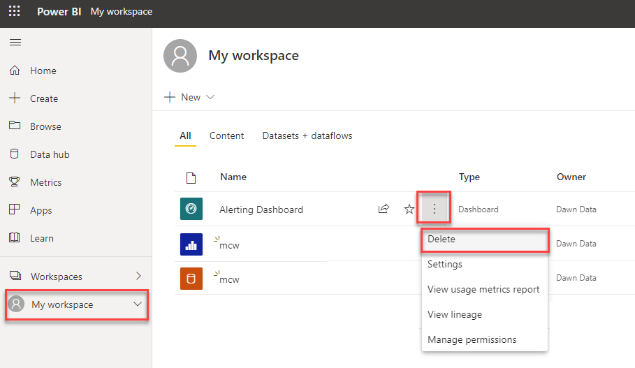

### Task 3: Remove deployed Azure resources with Terraform

1. In the Azure portal, select the cloud shell button from the upper-right toolbar menu options.

    

2. Navigate to the Terraform directory by executing the following command.

    ```PowerShell
    cd 'MCW-SAP-plus-extend-and-innovate-with-data-and-ai/Hands-on lab/Resources/terraform'
    ```

3. Enter the following command to remove all deployed resources, type `yes` and <kbd>Enter</kbd> when prompted.

    ```PowerShell
    terraform destroy
    ```

    > **Note**: Ensure the proper subscription is set using `az account set --subscription {SUBSCRIPTION_ID_GOES_HERE} if experiencing difficulties.

4. Execute the following command **two times** to return to the user directory.

    ```PowerShell
    cd..
    ```

5. Delete the cloned source code repository with the following command.

   ```PowerShell
   Remove-Item -Path .\MCW-SAP-plus-extend-and-innovate-with-data-and-ai -recurse -force  
   ```

### Task 4: Terminate the SAP CAL appliance

1. Log into the [SAP Cloud Appliance Library](https://cal.sap.com/) web site.

2. From the left menu, select **Appliances**, locate the **MCW SAP** appliance and expand the ellipsis menu. Select **Terminate** to delete the appliance.


You should follow all steps provided *after* attending the Hands-on lab.
