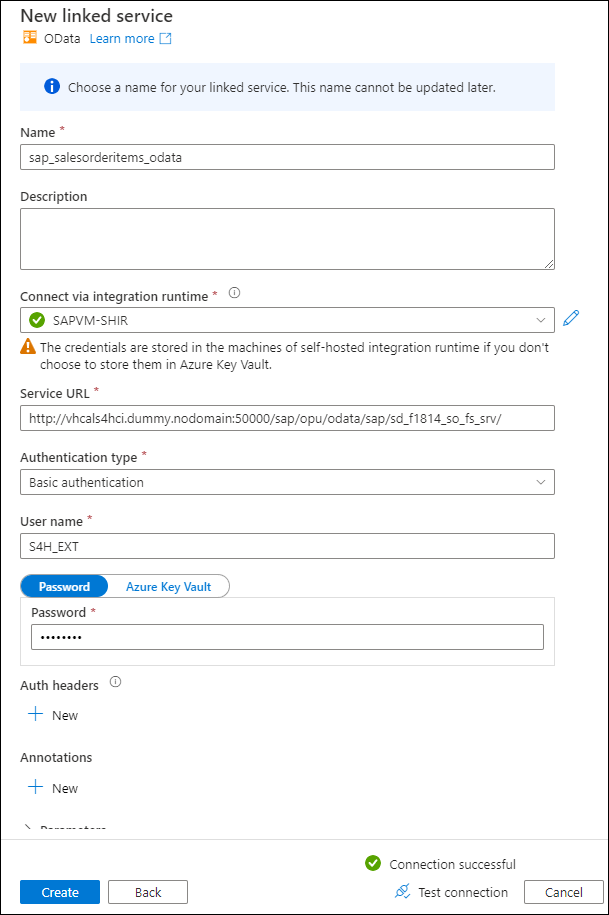
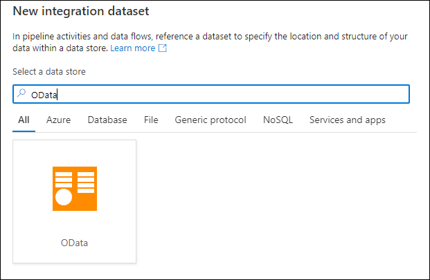
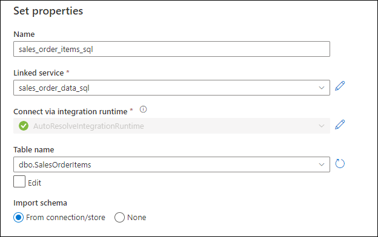
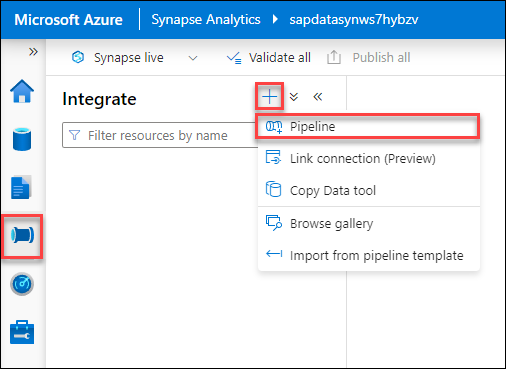
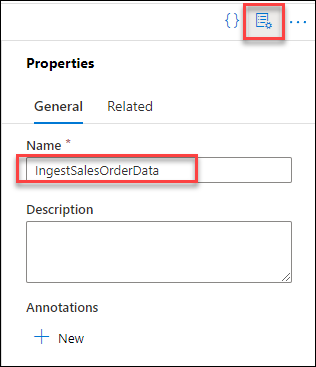
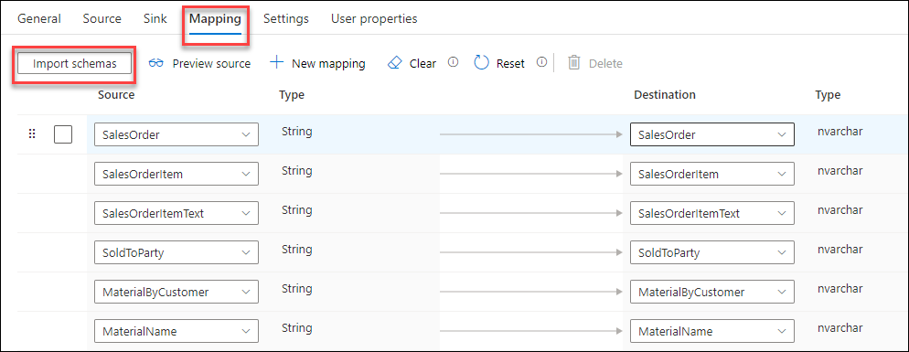

## Exercise 2: Ingest sales order information from SAP into Azure Synapse Analytics

## Lab Scenario
Historical sales order information resides in S/4HANA and is exposed with OData services. The self-hosted integration runtime installed on the SAP virtual machine enables connectivity between Azure Synapse Analytics and S/4HANA, this will allow for local web calls to take place to the OData endpoints to retrieve sales data.

## Objectives
  
After completing this lab, you will be able to:

- Create dedicated SQL pool tables to hold sales data
- Create a linked service to the SAP OData endpoint for sales order header information
- Create a linked service to the SAP OData endpoint for sales order item information
- Create a linked service to the dedicated SQL pool database
- Create integration datasets for sales order header and sales order items
- Create a pipeline to ingest sales data from S/4HANA

### Task 1: Create dedicated SQL pool tables to hold sales data

In this task, you will create two SQL tables in Synapse Studio: SalesOrderHeaders and SalesOrderItems. You will connect to the dedicated SQL pool sapdatasynsql and execute SQL commands to define these tables, which will hold sales data.

1. In Synapse Studio, select the **Develop** hub from the left menu, then expand the **+** menu from the center pane and choose **SQL script**.

    

1. In the SQL script tab, choose to connect to the **sapdatasynsql** dedicated SQL pool in the toolbar menu.

    

1. In the SQL script editor, paste and run the following SQL command to create the SalesOrderHeaders table. The **Run** button is located in the SQL script toolbar menu.

    ```SQL
    CREATE TABLE SalesOrderHeaders(
        BILLINGCOMPANYCODE nvarchar(4),
        BILLINGDOCUMENTDATE date,
        COUNTRY nvarchar(3),
        CREATIONDATE date,
        CREATIONTIME time,
        CREDITCONTROLAREA nvarchar(4),
        CUSTOMERACCOUNTGROUP nvarchar(4),
        CUSTOMERGROUP nvarchar(2),
        CUSTOMERNAME nvarchar(80),
        DISTRIBUTIONCHANNEL nvarchar(2),
        LASTCHANGEDATE date,
        LASTCHANGEDATETIME datetimeoffset,       
        ORGANIZATIONDIVISION nvarchar(2),
        PRICINGDATE date,
        PURCHASEORDERBYCUSTOMER nvarchar(35),
        SALESDISTRICT nvarchar(6),
        SALESDOCUMENT nvarchar(10) NOT NULL,
        SALESDOCUMENTPROCESSINGTYPE nvarchar(1),
        SALESDOCUMENTTYPE nvarchar(4),
        SALESGROUP nvarchar(3),
        SALESOFFICE nvarchar(4),
        SALESORGANIZATION nvarchar(4),
        SDDOCUMENTCATEGORY nvarchar(4),
        SOLDTOPARTY nvarchar(10),
        TOTALNETAMOUNT decimal(15, 2),
        TRANSACTIONCURRENCY nvarchar(5),
        CITYNAME nvarchar(35),
        POSTALCODE nvarchar(10)
    )
    ```

4. Replace the code in the script window with the following command to create the SalesOrderItems table. Run this script.

    ```SQL
    CREATE TABLE SalesOrderItems(
        SalesOrder nvarchar(10),
        SalesOrderItem nvarchar(6),
        SalesOrderItemText nvarchar(40),
        SoldToParty nvarchar(10),
        MaterialByCustomer nvarchar(35),
        MaterialName nvarchar(40),
        Material nvarchar(40),
        ShipToParty nvarchar(10),
        ShipToPartyName nvarchar(80),
        SDProcessStatus nvarchar(1),
        DeliveryStatus nvarchar(1),
        SDDocumentRejectionStatus nvarchar(1),
        SalesDocumentRjcnReason nvarchar(2),
        RequestedQuantity decimal(15,3),
        RequestedQuantityUnit nvarchar(3),
        TransactionCurrency nvarchar(5),
        NetAmount decimal(16, 3),
        MaterialGroup nvarchar(9),
        Batch nvarchar(10),
        ProductionPlant nvarchar(4),
        StorageLocation nvarchar(4),
        ShippingPointName nvarchar(30),
        ShippingPoint nvarchar(4),
        SalesOrderItemCategory nvarchar(4),
        BillingBlockCriticality tinyint,
        ItemBillingBlockReason nvarchar(2),
        OrderRelatedBillingStatus nvarchar(1),
        RequestedDeliveryDate date,
        HigherLevelItem nvarchar(6),
        SalesOrderProcessingType nvarchar(1),
        RequirementSegment nvarchar(40)
    )
    ```

### Task 2: Create a linked service to the SAP OData endpoint for sales order header information

In this task, you will create a linked service in Synapse Studio to connect to an SAP OData endpoint for sales order header information. You will configure the linked service with the necessary details, including the SAP OData URL, authentication type, and credentials, then test and create the connection.

A linked service describes connectivity to external resources. In this case, an authenticated OData-based linked service is required to pull sales order data from SAP.

1. In Synapse Studio, select the **Manage (1)** hub, then choose **Linked services (2)** from the center menu. Select **+ New (3)** in the Linked Services screen toolbar menu.

    

2. In the New linked service blade, search for and select **OData**. Select **Continue**.

    

3. Fill in the New linked service form as follows, then test the connection. Select **Test connection**, once it states that the connection is successful, elect **Create**.

    | Field | Value |
    |-------|-------|
    | Name | Enter `sap_salesorderheader_odata` |
    | Connect via integration runtime | Select **SAPVM-SHIR** |
    | Service URL | Use the SAP OData URL recorded in the Before the hands-on lab steps. This is the URL that ends in `ZBD_I_SALESDOCUMENT_E_CDS` |
    | Authentication type | Select **Basic authentication** |
    | User name | Enter `S4H_EXT` |
    | Password | Enter `Welcome1` |

    

### Task 3: Create a linked service to the SAP OData endpoint for sales order item information

In this task, you will create a linked service in Synapse Studio to connect to an SAP OData endpoint for sales order item information. You will configure the linked service with the required details, including the updated SAP OData URL, authentication type, and credentials, then test and create the connection.

1. In Synapse Studio, select the **Manage (1)** hub, then choose **Linked services (2)** from the center menu. Select **+ New (3)** in the Linked Services screen toolbar menu.

    

2. In the New linked service blade, search for and select **OData**. Select **Continue**.

    

3. Fill in the New linked service form as follows, then test the connection. Select **Test connection**, once it states that the connection is successful, elect **Create**.

    | Field | Value |
    |-------|-------|
    | Name | Enter `sap_salesorderitems_odata` |
    | Connect via integration runtime | Select **SAPVM-SHIR** |
    | Service URL | Use the SAP OData URL recorded in the from Before the hands-on lab steps. Replace **ZBD_I_SALESDOCUMENT_E_CDS** with `sd_f1814_so_fs_srv` in the URL value |
    | Authentication type | Select **Basic authentication** |
    | User name | Enter `S4H_EXT` |
    | Password | Enter `Welcome1` |

    

### Task 4: Create a linked service to the dedicated SQL pool database

In this task, you will create a linked service in Synapse Studio to connect to a dedicated SQL pool database. You will configure the linked service with the necessary details, including the Azure subscription, server name, and database name, and choose the authentication type. After setting up the linked service, you will publish the changes to finalize the configuration.

1. In Synapse Studio, select the **Manage (1)** hub, then choose **Linked services (2)** from the center menu. Select **+ New (3)** in the Linked Services screen toolbar menu.

    

2. In the New linked service blade, search for and select **Azure Synapse Analytics**. Select **Continue**.

    

3. In the New linked service Azure Synapse Analytics blade, populate the form as follows then select **Create**.

    | Field | Value |
    |-------|-------|
    | Name | Enter `sales_order_data_sql` |
    | Azure subscription | Select the Azure subscription for the lab. |
    | Server name | Select **sapdatasynws{SUFFIX}** |
    | Database name | Select **sapdatasynsql** |
    | Authentication type | Select **System-assigned managed Identity** |

    

4. On the Synapse Studio toolbar menu, select **Publish all**. Select **Publish** on the verification blade.

    

### Task 5: Create integration datasets for sales order header and sales order items

The Copy activity in Azure Synapse Analytics requires the usage of integration datasets to describe both the source and sink data sources. In this task, four integration datasets are defined representing sales order headers and sales order item data (source in S/4HANA OData and sink in dedicated SQL pool tables).

In this task, you will create integration datasets in Synapse Studio for sales order header and item data. You will define datasets for both the SAP OData source and the dedicated SQL pool tables. This involves setting up OData-based datasets for sales order headers and items, as well as datasets for the SQL pool tables. Finally, you will publish all changes to complete the setup.

1. In Synapse Studio, select the **Data** hub from the left menu and expand the **+** menu in the center pane. Select **Integration dataset**.

    

2. In the New integration dataset blade, search for and select **OData**. Select **Continue**.

    

3. On the **Set properties** blade, fill in the form as follows and select **OK**. This will create the integration dataset representing sales order header information.

    | Field | Value |
    |-------|-------|
    | Name | Enter `sales_order_headers_odata` (1) |
    | Linked service | Select **sap_salesorderheader_odata (2)** |
    | Path | Select **ZBD_I_Salesdocument_E (3)** |

    

4. Repeat steps 1 and 2 to create a new integration dataset. On the **Set properties** blade, fill in the form as follows and select **OK**. This creates the integration dataset for sales item information.

    | Field | Value |
    |-------|-------|
    | Name | Enter `sales_order_items_odata` |
    | Linked service | Select **sap_salesorderitems_odata** |
    | Path | Select **C_Salesorderitemfs** |

    

5. Now it is time to create the integration datasets for the sales order tables created in the dedicated SQL pool. In Synapse Studio, select the **Data** hub from the left menu and expand the **+** menu in the center pane. Select **Integration dataset**.

    

6. In the New integration dataset blade, search for and select **Azure Synapse Analytics**. Select **Continue**.

    

7. On the **Set properties** blade, populate the form as follows and select **OK**.

    | Field | Value |
    |-------|-------|
    | Name | Enter `sales_order_headers_sql` |
    | Linked service | Select **sales_order_data_sql** |
    | Table name | Select **dbo.SalesOrderHeaders** |
    | Import schema | Select **From connection/store** |

    

8. Repeat steps 5 and 6 to create a new Azure Synapse Analytics integration dataset. On the **Set properties** blade, populate the form as follows and select **OK**.

    | Field | Value |
    |-------|-------|
    | Name | Enter `sales_order_items_sql` |
    | Linked service | Select **sales_order_data_sql** |
    | Table name | Select **dbo.SalesOrderItems** |
    | Import schema | Select **From connection/store**|

    

9. On the Synapse Studio toolbar menu, select **Publish all**. Select **Publish** on the verification blade.

    

### Task 6: Create a pipeline to ingest sales data from S/4HANA

An Azure Synapse Analytics pipeline can be used to move data from source to sink. The Copy data activity moves data from a source dataset to a sink dataset. This task creates a pipeline with two Copy data activities to move the sales order header and sales order items data from S/4HANA into the dedicated SQL pool tables in Azure Synapse Analytics.

In this task, you will create an Azure Synapse Analytics pipeline to ingest sales order data from S/4HANA. You will configure two Copy data activities: one for sales order headers and another for sales order items. After setting up and publishing the pipeline, you will trigger it and monitor the data transfer to ensure it is correctly ingested into the SQL pool.

1. In Synapse Studio, select the **Integrate** hub from the left menu. Expand the **+** menu from the center pane and choose **Pipeline**.

    

2. In the Properties blade, enter the name `IngestSalesOrderData`. Optionally collapse the Properties blade using the button on the toolbar of the pipeline.

    

3. From the Activities menu, expand the **Move & transform** section, then drag-and-drop a **Copy data** activity to the pipeline visual canvas. With the Copy data activity selected, enter `copy_sales_order_headers` in the **Name** field.

    

4. With the **copy_sales_order_headers** activity selected, select the **Source** tab. In the **Source dataset** tab, select **sales_order_headers_odata**.

    

5. With the **copy_sales_order_headers** activity selected, select the **Sink** tab. Select **sales_order_headers_sql** as the Sink dataset, and **Bulk insert** as the **Copy method**.

6. Within the **copy_sales_order_headers** activity selected, select the **Mapping** tab. Select the **Import schemas** button to review the data mapping.

    

7. With the **copy_sales_order_headers** activity selected, select the **Settings** tab. Check the **Enable staging** checkbox, then select **datalake** for the **Staging account linked service** and enter `staging` in the **Storage Path** field.

    

8. Drag-and-drop another instance of the Copy data activity to the pipeline visual canvas. On the **General** tab enter `copy_sales_order_items`.

     

9. With the **copy_sales_order_items** activity selected, select the **Source** tab. In the **Source dataset** tab, select **sales_order_items_odata**.

    

10. With the **copy_sales_order_items** activity selected, select the **Sink** tab. In the **Sink dataset** tab, select **sales_order_items_sql**.

    

11. With the **copy_sales_order_items** activity selected, select the **Mapping** tab. Select the **Import schemas** button to review the mapping of the data fields.

    

12. With the **copy_sales_order_items** activity selected, select the **Settings** tab. Check the **Enable staging** checkbox, then select **datalake** for the **Staging account linked service** and enter `staging` in the **Storage Path** field.

    

13. On the Synapse Studio toolbar menu, select **Publish all**. Select **Publish** on the verification blade.

    

14. Once published, expand the **Add trigger** item on the pipeline toolbar and select **Trigger now**. Select **OK** on the Pipeline run blade.

    

15. On the left menu of Synapse Studio, select the **Monitor** hub. Ensure **Pipeline runs** is selected from the center menu. Observe the IngestSalesOrderData pipeline status over time. Use the **Refresh** button to update the table.

    

16. Upon successful completion of the pipeline run, verify data was copied by accessing the **Develop** hub from the left menu, expanding the **+** menu and selecting **SQL script**. In the **Connect to** field of the SQL script, select **sapdatasynsql**. In the query window, paste the following SQL commands and run the queries.

    ```sql
    select count(*) from SalesOrderHeaders;
    select count(*) from SalesOrderItems;
    ```

17. Toggle the **Select** drop down to view the results of each query executed. Ensure the values for each query are non-zero.

    

## Summary

In this exercise, you have set up linked services for SAP OData and a dedicated SQL pool in Azure Synapse Analytics. You created integration datasets for sales orders and configured a pipeline with Copy data activities to move data from SAP to SQL. Finally, you triggered the pipeline, monitored its progress, and verified the data transfer by running SQL queries.

## You have successfully completed this exercise. Select **Next >>** to proceed to the next one.
