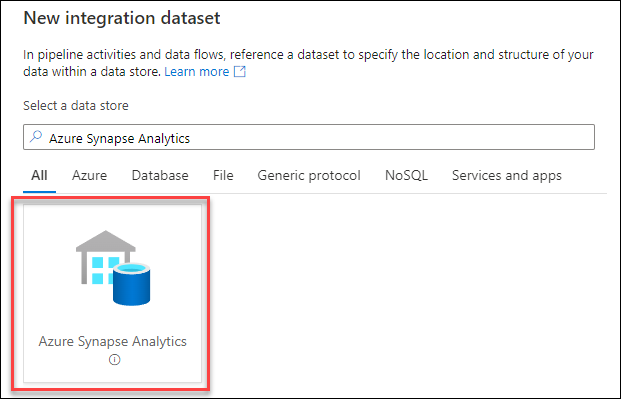
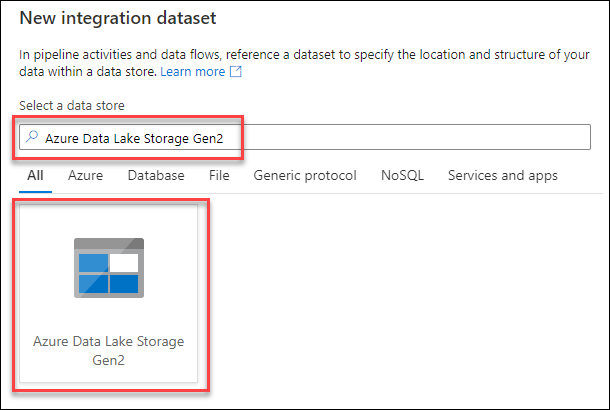
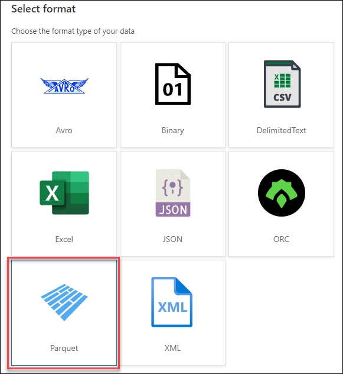
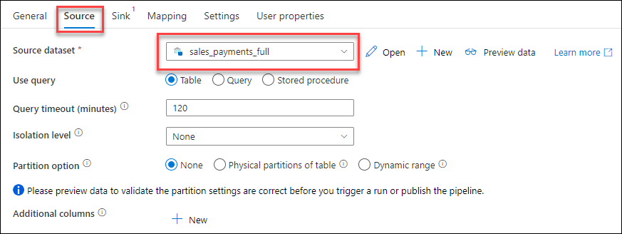

## Exercise 4: Prepare data for the incoming cashflow prediction model training

Duration: 30 minutes

Contoso Retail would like to take advantage of the historical sales order and payment data to create a machine learning model that predicts incoming cashflow. In this exercise, a Sales Order and Payments data are combined in a SQL view whose data is then stored as a parquet file in Azure Data Lake Storage Gen2.

### Task 1: Create a SQL view that combines sales orders with payments data

1. In Synapse Studio, select the **Develop** hub from the left menu, then expand the **+** menu from the center pane and choose **SQL script**.

    

2. In the SQL script tab, choose to connect to the **sapdatasynsql** dedicated SQL pool in the toolbar menu.

    

3. In the SQL script editor, paste and run the following SQL command to create the SalesPaymentsFull view that joins the SalesOrderHeaders and Payments data. The **Run** button is located in the SQL script toolbar menu.

   ```SQL
   CREATE VIEW [dbo].[SalesPaymentsFull]
        AS SELECT s.[SALESDOCUMENT]
        , s.[CUSTOMERNAME]
        , s.[CUSTOMERGROUP]
        , s.[BILLINGCOMPANYCODE]
        , s.[BILLINGDOCUMENTDATE]
        , p.[PaymentDate] as PAYMENTDATE
        , s.[CUSTOMERACCOUNTGROUP]
        , s.[CREDITCONTROLAREA]
        , s.[DISTRIBUTIONCHANNEL]
        , s.[ORGANIZATIONDIVISION]
        , s.[SALESDISTRICT]
        , s.[SALESGROUP]
        , s.[SALESOFFICE]
        , s.[SALESORGANIZATION]
        , s.[SDDOCUMENTCATEGORY]
        , s.[CITYNAME]
        , s.[POSTALCODE]
        , DATEDIFF(dayofyear, s.BILLINGDOCUMENTDATE, p.PaymentDate) as PAYMENTDELAYINDAYS
    FROM [dbo].[SalesOrderHeaders] as s
    JOIN [dbo].[Payments] as p ON REPLACE(LTRIM(REPLACE(s.[SALESDOCUMENT], '0', ' ')), ' ', '0') = p.[SalesOrderNr]
   ```

### Task 2: Move the view data to a parquet file in Azure Data Lake Storage Gen2

In this task, a pipeline is created to copy the SalesPaymentsFull view to a parquet file in storage. To implement this pipeline, two additional integration datasets are required, one that points to the SalesPaymentFull view, and one that points to the desired location of the parquet file in Azure Data Lake Storage Gen2.

1. In Synapse Studio, select the **Data** hub from the left menu and expand the **+** menu in the center pane. Select **Integration dataset**.

    

2. In the New integration dataset blade, search for and select **Azure Synapse Analytics**. Select **Continue**.

    

3. On the **Set properties** blade, populate the form as follows and select **OK**.

    | Field | Value |
    |-------|-------|
    | Name | Enter `sales_payments_full`. |
    | Linked service | Select **sales_order_data_sql**. |
    | Table name | Select **dbo.SalesPaymentsFull**. |
    | Import schema | Select **From connection/store**. |

    

4. Remaining in the Data hub, expand the **+** menu in the center pane. Select **Integration dataset**.

    

5. In the New integration dataset blade, search for and select **Azure Data Lake Storage Gen2**. Select **Continue**.

    

6. On the Select format blade, select **Parquet**. Select **Continue**.

   

7. On the Set properties blade, complete the form as follows, then select **OK**.

    | Field | Value |
    |-------|-------|
    | Name | Enter `sales_payment_full_parquet`. |
    | Linked service | Select **datalake**. |
    | File path | Enter **sales-payment-parquet**. |
    | Import schema | Select **None**. |

    

8. On the Synapse Studio toolbar menu, select **Publish all**. Select **Publish** on the verification blade.

    

9. In Synapse Studio, select the **Integrate** hub from the left menu. Expand the **+** menu from the center pane and choose **Pipeline**.

    

10. In the Properties blade of the pipeline, name the pipeline **CreateSalesPaymentsParquet**. Optionally collapse the Properties blade.

    

11. In the Activities menu, expand the **Move & Transform** section. Drag-and-drop the **Copy data** activity to the pipeline design canvas. In the General tab of the Copy data activity enter `CopySalesPaymentsAsParquet`.

    

12. With the Copy data activity selected, choose the **Source** tab. Select **sales_payments_full** as the **Source dataset**.

    

13. With the Copy data activity selected, choose the **Sink** tab. Select **sales_payment_full_parquet** as the **Sink dataset**.

    

14. With the Copy data activity selected, choose the **Settings** tab. Check the **Enable staging** checkbox, then select **datalake** for the **Staging account linked service** and enter `staging` in the **Storage Path** field.

    

15. On the Synapse Studio toolbar menu, select **Publish all**. Select **Publish** on the verification blade.

    

16. Once published, expand the **Add trigger** item on the pipeline toolbar and select **Trigger now**. Select **OK** on the Pipeline run blade.

    

17. Use the **Monitor** hub to ensure the pipeline run has successfully completed.

    
