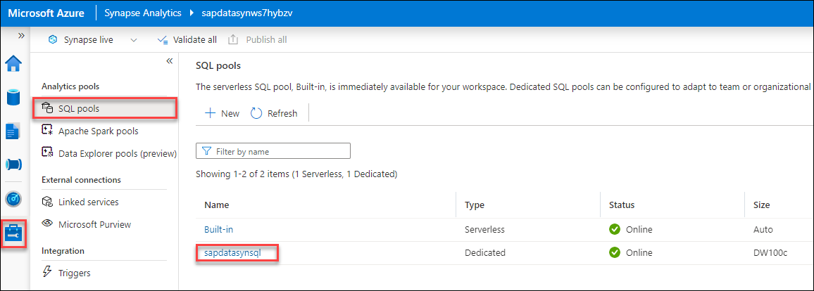
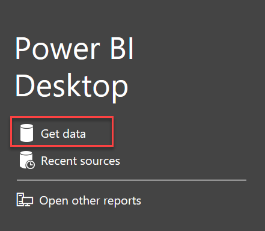
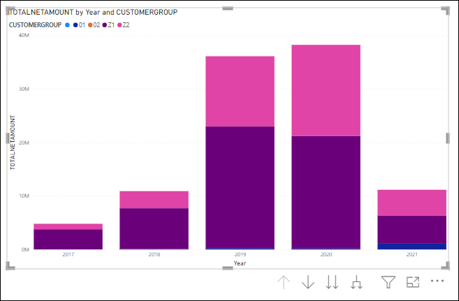
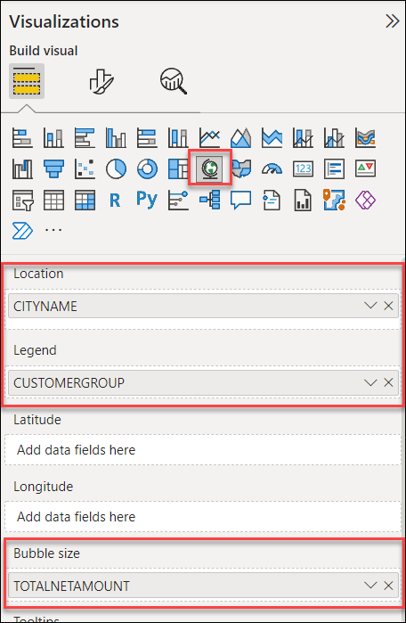
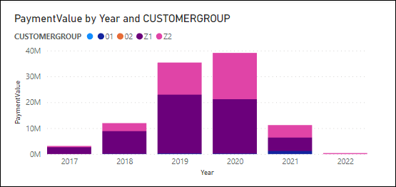
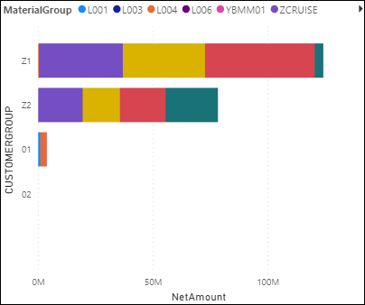
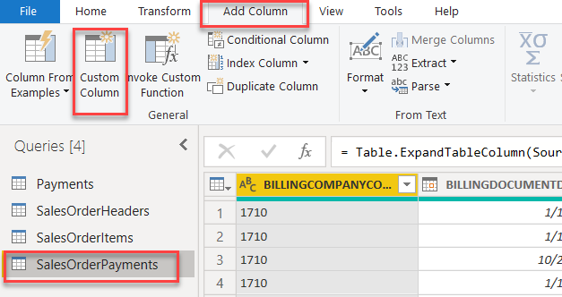
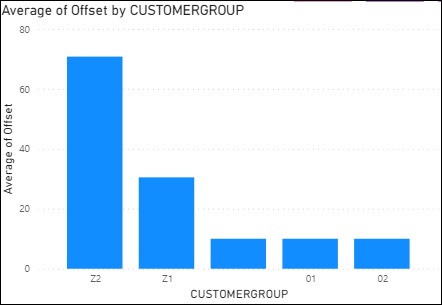

## Exercise 7: Visualize historical data with Power BI

Duration: 40 minutes

In this exercise, we will implement visualizations to help Contoso Retail gain insight into historical sales orders and payment data.

### Task 1: Retrieve the database connection information for the dedicated SQL pool

1. In Synapse Studio, open the **Manage** hub from the left menu, choose **SQL pools** from the center menu and select the **sapdatasynsql** dedicated SQL pool from the list.

    

2. On the Properties blade, record the values for the **Name** and **Workspace SQL endpoint** fields.

    

### Task 2: Import data into Power BI

1. Open **Power BI Desktop**. On the splash screen, select the **Get Data** item.

    

2. On the Get Data dialog, select **Azure** from the left menu and select **Azure Synapse Analytics SQL** from the listing. Select the **Connect** button.

    

3. On the SQL Server database dialog, populate the form as follows and select **OK**.

    | Field | Value |
    |-------|-------|
    | Server | Enter the **Workspace SQL endpoint** value recorded in the previous task. |
    | Database | Enter the **Name** value recorded in the previous step. |
    | Data Connectivity mode | Select **Import**. |

    

4. An authentication dialog displays, select **Microsoft account** from the left menu, then select the **Sign in** button. Authenticate with your Azure credentials.

    

5. Once signed in, select the **Connect** button on the dialog.

6. On the Navigator dialog, check the box next to all three tables, then select the **Transform Data** button.

    

7. The columns in the tables representing sales order numbers were incorrectly interpreted as strings by Power BI. In the Power Query editor screen, select **SalesOrderItems** from the Queries pane, then right-click on the **SalesOrder** field and expand the **Change Type** item and choose **Whole Number**.

    

8. Repeat the previous step, this time changing the type of the following table columns to Whole Number.

    | Table (Queries pane) | Column |
    |-------|-------|
    | SalesOrderHeaders | SALESDOCUMENT |
    | Payments | SalesOrderNr |

9. Select **Close & Apply** in the Power Query editor toolbar.

    

### Task 3: Create the relational model

1. From the left menu, select the **Model** item. This will switch to the Model view.

    

2. On the Model design canvas, drag the SALESDOCUMENT field from the SalesOrderHeaders table and drop it on the SalesOrder field of the SalesOrderItems table. This establishes a one-to-many relationship (1:*) between the tables.

    

3. On the Model design canvas, drag the SalesOrderNr field from the Payments table and drop it on the SALESDOCUMENT field in the SalesOrderHeaders table. This establishes a one-to-one relationship (1:1) between the tables.

   

4. Select the **Report view** on the left menu to return to the report designer.

    

### Task 4: Create a sales per data and customer group visualization

1. In the Visualizations pane, select **Stacked column chart**. From the **Data** pane, drag-and-drop the SalesOrderHeaders.CREATIONDATE field to the X-axis box, the SalesOrderHeaders.TOTALNETAMOUNT field to the Y-axis box and the SalesOrderHeaders.CUSTOMERGROUP field to the Legend box.

    

2. Adjust the sizing of the chart on the report canvas as desired.

    

### Task 5: Create a sales per region and customer group visualization

1. In the Visualizations pane, select **Map**.

2. From the **Data** pane, drag-and-drop the SalesOrderHeaders.CITYNAME field to the Location box, the SalesOrderHeaders.CUSTOMERGROUP field to the Legend box and the SalesOrderHeaders.TOTALNETAMOUNT to the Bubble size box.

   

    > **Note**: Map visuals are disabled by default, access File -> Options and Settings -> Options -> Global - Security to enable. After updating Options in Power BI, you may need to close and reopen the report for the settings change to take effect.
    > 

3. Adjust the sizing and zoom of the map on the report canvas as desired.

    

### Task 6: Create a payments per date and customer group visualization

1. In the Visualizations pane, select **Stacked Column Chart**.

2. From the **Data** pane, drag-and-drop the Payments.PaymentDate field to the X-axis box, the Payments.PaymentValue field to the Y-axis box and the SalesOrderHeaders.CUSTOMERGROUP field to the Legend box.

    

3. Adjust the sizing of the chart on the report canvas as desired.

    

### Task 7: Create a sales per customer group and material group visualization

1. In the Visualizations pane, select **Stacked Bar Chart**.

2. From the **Data** pane, drag-and-drop the SalesOrderHeaders.CUSTOMERGROUP field to the Y-axis box, the SalesOrderItems.NetAmount field to the X-axis box and the SalesOrderItems.MaterialGroup field to the Legend box.

    

3. Adjust the sizing of the chart on the report canvas as desired.

    

### Task 8: Create a payment offset per customer group visualization

This report shows the average number of days by which each customer group pays their SalesOrders. Afterwards, a comparison can be made with the outcome of the Machine Learning Model built in the next exercise. SalesOrderHeaders and the Payment data are combined to calculate the number of days between the billing date and the payment date.

1. In Power BI Desktop, expand the **Transform data** item on Home tab toolbar menu. Select **Transform data**.

   

2. In the Power Query Editor window, select the **SalesOrderHeaders** table from the Queries pane, and expand the **Merge Queries** option on the Home toolbar menu. Select the **Merge Queries as New** option.

      

3. In the Merge window, select the SALESDOCUMENT column of the SalesOrderHeaders table. Select the **Payments** table as the second table and select the SalesOrderNr field. Select **OK**.

    

4. Rename the Merge query by right-clicking the Merge query in the Queries pane and selecting **Rename**. Name the merged query **SalesOrderPayments**.

5. With the SalesOrderPayments query selected, scroll the table completely to the right. Expand the **Payments** column menu, and choose to include the following fields: **PaymentNr**, **PaymentDate**, **PaymentValue** and **Currency**. Select **OK**.

    

6. Select **Close & Apply** in the Power Query editor toolbar.

    

7. From the report designer, expand the **Transform data** item on Home tab toolbar menu. Select **Transform data**.

   

8. In the Power Query Editor window, select the **SalesOrderPayments** table from the Queries pane. A new column is required to calculate the difference between the billing date and the actual payment data. Select the **Add Column** tab and select the **Custom Column** button on the toolbar menu.

    

9. In the Custom Column window, enter `Offset` for the New column name. In the Custom column formula field, enter the following formula. Select **OK**.

    ```vb
    Duration.Days([Payments.PaymentDate] - [BILLINGDOCUMENTDATE])
    ```

    

10. In the table, right-click on the newly created Offset field and expand the **Change Type** option. Select **WholeNumber** to convert this column to integer.

    

11. Return to the Home tab and select **Close & Apply** in the Power Query editor toolbar.

    

12. On the report canvas, add a **Stacked Column** chart. Drag-and-drop the SalesOrderPayments.CUSTOMERGROUP to the X-axis box and SalesOrderPayments.Offset to the Y-axis box. Expand the chevron menu next to the Offset column and choose to report the **Average**.

    

13. Adjust the sizing of the chart on the report canvas as desired.

    

### Task 9: Create a payment offset per customer group box plot visualization (Optional)

A box plot can provide a more detailed view of the payment offset by customer group data.

1. In the Visualizations pane, expand the ellipsis menu and select **Get more visuals**.

    

2. On the Power BI visuals window, search for **Box and Whisker**. Then choose the **Box and Whisker chart** by DataScenarios.

    

3. On the AppSource window, select the **Add** button to add the Box and Whisker chart.

    

4. On the Visualizations pane, select the newly added **Box and Whisker** chart. In the Category field, drag-and-drop the SalesOrderPayments.CUSTOMERGROUP, SalesOrderPayments.Offset into the Sampling field, and SalesOrderPayments.Offset into the Value field. Expand the chevron menu in the Value field and select the **Average** option.

    

5. Adjust the sizing of the chart on the report canvas as desired.

    

    > **Note**: From this diagram you can see that:

    > - CustomerGroup1 pays within 70 days +/- 10 days
    > - CustomerGroup2 pays within 30days +/- 5 days
    > - Other customergroups pay after 10 days

6. Keep this report open in Power BI desktop for future exercises.

7. If you haven't completed the deployment of the AML model, return to Exercise 5. 
